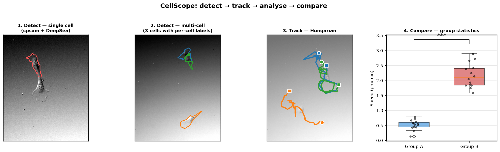

# CellScope — Project Status

*Last updated: 2026-05-01*



## What is CellScope?

CellScope is an automated cell detection, tracking, and analysis
platform for DIC and phase-contrast time-lapse microscopy. It provides
end-to-end analysis from raw recordings to publication-ready figures
and statistical comparisons.

Built to analyze migrating keratinocytes from Holt et al. 2021 (eLife),
extensible to any single- or multi-cell DIC/phase-contrast recordings.

---

## Architecture

```
┌─────────────────────────────────────────────────────────┐
│                    main_suite.py                        │
│              Unified Launcher (tkinter)                 │
├───────────┬───────────┬──────────┬──────────┬──────────┤
│ Detection │   Batch   │ Tracking │   Mask   │ Training │
│ & Analysis│ Processing│ & Stats  │  Editor  │          │
│ (focused) │  (batch)  │(tracking)│ (editor) │(training)│
├───────────┴───────────┴──────────┴──────────┴──────────┤
│                   gui/ (shared)                         │
│        mask_editor, run_log, options panels             │
├────────────────────────────────────────────────────────┤
│                    core/ (34 modules)                   │
│  detection · tracking · morphology · edge dynamics      │
│  preprocessing · refinement · statistics · VAMPIRE      │
├────────────────────────────────────────────────────────┤
│                    output/                              │
│        masks.npz · metrics.json · plots · CSV           │
└────────────────────────────────────────────────────────┘
```

- **109 Python files** across 9 packages
- **5 specialized GUIs** + unified launcher
- **34 core modules** for detection, tracking, and analysis
- **Dual conda environments**: cellpose4 (cpsam ViT) + cellpose (CP3 fallback)

---

## Detection Pipelines

### Phase-Contrast (Ignasi's recordings)
```
cpsam (ViT) → DeepSea union → fallback (CP3) → gap fill
```
- **0.932 IoU** on 65 GT frames (best result)
- 100% detection across 5 recordings (485 frames)
- Auto-fallback rescues 1-4 frames per recording

### DIC (Jesse's VAMPIRE / our keratinocytes)
```
cpsam_dic (CP4 ViT, via cellpose4 subprocess) → DeepSea union → fallback
```
- **0.795 IoU** on our 526² in-domain GT (cpsam_dic, current best)
- **0.697 IoU** on VAMPIRE held-out OOD crops (cpsam_dic, +0.42 over cellpose_dic_v3)
- +280% over default cpsam on DIC (0.697 vs 0.183)
- Modality auto-detection routes to correct pipeline. CP3 fine-tunes
  (cellpose_dic_v3, etc.) remain available as faster fallbacks.

### Multi-Cell
```
cpsam/cellpose → debris filter → DeepSea per-cell → Hungarian tracker
→ gap fill → post-process → division annotation (lineage)
```
- Division detection (mother→daughter tracking) — biology-aware
  annotator (`core/division_annotator.py`) sets `parent_id` +
  `division_score` + `division_frame` on daughter tracks; writes
  `divisions.json` sidecar next to `masks.npz`. **1 / 2 GT divisions
  caught across 9 GT recordings** (Pos39_OT). Pos51_Y1's split was
  caught under the legacy single-track output but lost after the
  2026-05-20 auto-select probe upgrade routed it to raw cpsam (3
  tracks now where 1 used to be — the annotator's pre-mitotic-
  swelling pattern was tuned against single-track lineages and needs
  to be updated for multi-track resolves).
  Filter relaxation 2026-05-17: pre-mitotic-balled check spans the
  [pre, post]-split window (PRE_STATE_LOOKBACK=3 + POST_STATE_WINDOW=3)
  and daughter persistence tolerates a 2-frame gap during the contact
  phase (`MAX_DAUGHTER_GAP_FRAMES=2`).
- 100% gap fill rate (41/41 gaps on tested recordings)
- TRA 0.929 on CTC DIC-C2DH-HeLa benchmark

---

## Models

| Model | Type | Trained On | Best For |
|-------|------|-----------|----------|
| **cpsam_dic** ★ | ViT (CP4) | 1,000 DIC pairs (Colab fine-tune of base cpsam) | **DIC, current best** (0.795 in-domain, 0.697 OOD) |
| cpsam (default) | ViT (CP4) | General microscopy | Phase-contrast |
| cellpose_dic_v3 | CNN (CP3) | 2,644 standardized 448px crops | Faster DIC alternative |
| cellpose_dic_v2 | CNN (CP3) | 2,812 DIC pairs (VAMPIRE+GT+CTC) | Legacy DIC |
| cellpose_dic | CNN (CP3) | Our DIC keratinocytes | Original DIC fine-tune |
| cellpose_combined_robust | CNN (CP3) | 5,826 augmented pairs | Noisy / perturbed recordings |
| DeepSea | U-Net | Brightfield/phase-contrast | Boundary refinement |
| MedSAM | SAM-ViT | Biomedical images | Foundation model refinement |

---

## Benchmark Results

### Phase-Contrast Detection (Ignasi GT, 65 frames)
| Method | Mean IoU | >0.85 | Min |
|--------|----------|-------|-----|
| **cpsam + DeepSea** | **0.932** | 65/65 | 0.867 |
| cellpose + MedSAM + DeepSea | 0.907 | 55/65 | 0.629 |
| cpsam alone | 0.915 | 56/65 | — |

### DIC Detection — head-to-head (90 stratified frames per test)
| Test set | cellpose_dic_v3 | cpsam_dic v1 | **cpsam_dic v2** | v2 vs v3 |
|---|---:|---:|---:|---:|
| In-domain 526² DIC GT | 0.740 | 0.795 | **0.826** | **+0.086** |
| Out-of-domain DIC crops | 0.279 | 0.697 | **0.754** | **+0.475** |
| Detection rate (in-domain) | 95% | 100% | **100%** | +5pp |
| Detection rate (OOD) | 42% | 88% | **96%** | +54pp |

### Out-of-domain per-genotype (cpsam_dic v2)
| Genotype | IoU | std |
|---|---:|---:|
| control | 0.871 | 0.105 |
| cKO | 0.678 | 0.291 |
| GoF | 0.713 | 0.159 |
| **mean** | **0.754** | 0.218 |

cpsam_dic (current) is the result of resuming Colab fine-tuning to
~20 epochs from a partial 6-epoch checkpoint. The Drive download URL
in `download_models.py` serves this same v2 file.

### Older DIC benchmarks (legacy CP3 models, kept for reference)
| Method | control | cKO | GoF | Mean |
|--------|---------|-----|-----|------|
| cellpose_dic_v2 + preproc | 0.874 | 0.503 | 0.159 | 0.512 |
| cellpose_combined_robust | 0.652 | 0.352 | 0.434 | 0.479 |
| cellpose_dic + preproc | 0.493 | 0.456 | 0.191 | 0.380 |
| cpsam (no fine-tune) + DeepSea | — | — | — | 0.183 |

### Multi-Cell Tracking (CTC DIC-C2DH-HeLa)
| Tracker | DET | TRA | SEG |
|---------|-----|-----|-----|
| **Hungarian (ours)** | 0.936 | **0.929** | 0.860 |
| Trackastra | 0.935 | 0.847 | 0.860 |

---

## Analysis Capabilities

**20 graph types** including:
- Cell trajectory + speed over time
- MSD with diffusion model fit (D and α extraction)
- Area, circularity, aspect ratio timeseries
- Edge velocity kymograph (16 angular sectors)
- Protrusion/retraction rates
- VAMPIRE shape modes (PCA eigenshapes + K-means clustering)
- Shape mode distribution + heterogeneity (Shannon entropy)
- Frame quality assessment
- Bootstrap confidence intervals on all metrics

**Statistical comparison** (batch mode):
- 2 groups: t-test, Mann-Whitney, Cohen's d
- 3+ groups: ANOVA, Kruskal-Wallis, Bonferroni post-hoc
- Auto parametric/non-parametric selection via Shapiro-Wilk
- Box/violin plots with significance brackets

---

## GUI Features

### Detection & Analysis GUI (`main_focused.py`)
- Single-cell and multi-cell modes
- Modality selector: Auto / DIC / Phase-contrast
- Brightness/contrast adjustment, zoom, pan
- Frame navigator bar (green=detected, red=missed)
- ROI selector (rectangle/ellipse/polygon)
- Cancel button with elapsed time display
- Drag-and-drop file loading
- Project save/load (.cellscope format)
- 20 analysis graph types with resizable panels
- Export: masks, metrics, plots, MP4 overlay video, per-cell CSV

### Mask Editor (`main_editor.py`)
- Brush/eraser/polygon/fill tools
- Multi-cell labels (keys 1-9, spinbox for more)
- Per-cell colored overlay
- Relabel tool (connected component only)
- Separate brush/eraser size controls
- Send corrections back to main GUI

### Batch Processing (`main_batch.py`)
- Directory scan, recording tree
- Group-by-folder organization
- Per-recording and group CSV summaries

### Tracking & Comparison (`main_tracking.py`)
- Single recording: load masks → track → per-cell analysis
- Batch: multi-recording group comparison with statistical tests

### Training (`main_training.py`)
- Data preview thumbnails
- Live loss curve
- Augmentation options (noise, gamma, flip)

---

## Data Assets

| Dataset | Pairs | Format | Purpose |
|---------|-------|--------|---------|
| VAMPIRE (Jesse) | 5,290 | TIFF crops | DIC keratinocyte training |
| Our GT (control) | 122 | PNG 526² | Full-frame evaluation |
| Our GT (cKO) | 122 | PNG 526² | Full-frame evaluation |
| CTC DIC-HeLa | 168 | PNG 512² | Cross-domain benchmark |
| Augmented v2 | 5,269 | PNG | Robustness training |
| dic_splits_v3 (448px) | 4,302 | TIFF 448² | Standardized DIC training |

**29 VAMPIRE cell sequences** across 3 genotypes (control, cKO, GoF)
from 4 experiments (85, 100, 126, 135, 240).

---

## What's Working Well

- **Phase-contrast detection**: 0.932 IoU, 100% detection — production ready
- **Multi-cell tracking**: TRA 0.929 on CTC benchmark; biology-aware division annotator (`core/division_annotator.py`) detects pre-mitotic-swelling → balled → split → grown-daughter pattern. **1 / 2 GT divisions caught across 9 IC295 GT recordings** (Pos39_OT). Pos51_Y1's split was caught under the legacy cpsam_dic single-track output; lost on the 2026-05-20 auto-select rework that routes it to multi-track raw cpsam (annotator needs to handle multi-track resolves).
- **Multichannel GT aggregate**: 6 IC295 conditions (WT/KO/GOF/OT/Y1/DMSO) at mean per-cell IoU **0.846**, F1@.5 **0.83**, ID consistency **95.92%** (238 frames across 9 recordings). Improved from 0.822 / 0.82 / 94.91% on 2026-05-20 by switching the auto-select probe to raw cpsam (no cell-merging bias); Pos51_Y1 and Pos68_DMSO both gained ~+0.10 IoU on the re-run, Pos51_Y1 went 83% → 100% ID consistency.
- **Analysis suite**: 20 graph types, VAMPIRE shape modes, statistical comparison
- **GUI**: 5 specialized apps covering the full workflow
- **Robustness**: cellpose_robust_v2 wins 9/11 perturbation tests

## Current Limitations

- **GoF cKO heterogeneity**: cpsam_dic cKO std is 0.39 (vs 0.08 for
  control) — most cKO frames hit IoU 0.85+, but a tail of frames with
  thin filopodia or unusual morphology score below 0.4. Manual editing
  recovers these.
- **Multi-cell GT**: Limited ground truth for multi-cell evaluation
  beyond CTC DIC-C2DH-HeLa.
- **ID switching**: Touching cells still cause occasional identity
  swaps in the Hungarian tracker.
- **Brightness shifts**: All detectors lose ~30% IoU on `bright_dark` /
  `bright_bright` perturbations (would need brightness-augmented
  retraining to fix).

---

## In Progress

1. **IC293 full pipeline run** (started 2026-05-01) — 16 new full-frame
   2048×2048 phase-contrast Ignasi recordings × 5 conditions
   (WT/KO/GOF/Y1/DMSO). 8/16 done at the time of writing, ~50 min per
   recording, ETA total ~13 h. Caching per recording, resumable.
   Outputs: `results/ignasi_new_full/{<pos>_<cond>.npz, .html,
   _image.tif, _labels.tif}` + summary CSV + RUN_METADATA.md.
   Best config from comparison: `cpsam_base` (no fine-tune) without
   TTA, with flat-field σ=80 preprocessing — wins by 2.5× over
   `cpsam_dic` on these out-of-distribution recordings.
2. **IC295 multichannel pipeline (DIC + SiR-actin Cy5)** — Phases 1–2c
   built and unit-tested. Pilot queued for after IC293 frees the GPU.
   See `docs/multichannel_analysis_plan.md`.
3. **IC295 ground truth** — 38 candidates sampled to
   `data/ic295_gt/candidates/` (each candidate = DIC + Cy5 + composite
   PNGs), pending hand-labelling. After labelling,
   `scripts/bench_multichannel.py` quantifies IoU DIC-only vs
   AND-fusion vs full 3-tier per condition.
4. **Resume cpsam_dic fine-tune** — current model is from a partial
   ~6-epoch run that timed out on Colab. Resuming notebook is at
   `notebooks/resume_cpsam_dic_colab.ipynb`; expect another +0.02 IoU
   when the full 20-epoch run completes.
5. **Distribution polish** — install scripts, model bundles, and Drive
   downloader are wired (`install.{bat,sh}`, `download_models.py`,
   `make_models_bundle.py`, `make_dist.py`). Doc updates in flight.

## Planned Next Steps

- Run IC295 multichannel pilot once IC293 GPU is free.
- Hand-label IC295 GT, then quantitative benchmark.
- Phase 3 of multichannel: Cy5 features in Hungarian tracker.
- Phase 4 of multichannel: track-quality penalty for low-Cy5 tracks.
- Phase 5 of multichannel (speculative): subcellular features
  (lamellipodia polarity, cortex ratio, stress-fibre density) — most
  likely to give a strong Piezo1 phenotype signal.
- Multi-cell ground truth expansion (broader CTC test or new annotated
  Jesse recordings).
- Boundary separation for touching cells in dense recordings.
- Brightness-augmented retrain (3.5 in roadmap; setup done).
- GitHub release once distribution dry-run is complete.

---

## GUI test coverage

**107/107 checks pass across 7 phases (A–G) covering 6 GUIs** —
see `results/comprehensive_gui_tests/FINAL_REPORT.md` and 63
screenshots in `results/comprehensive_gui_tests/screenshots/`.

| Phase | GUI(s) | Checks | Coverage |
|---|---|---:|---|
| A | Detection & Analysis (single-cell) | 59 | load → detect → analyze → 16 graph types → export, B/C, zoom, pan, frame nav |
| B | Detection & Analysis (multi-cell) | 8 | mode switch, multi detection, per-cell analytics, all 20 graphs, cell selector |
| C | ROI + Mask Editor integration | 9 | draw / persist / apply / clear ROI, mask editor open + send-to-GUI roundtrip |
| D | Batch GUI | 6 | directory scan, recording tree, settings widgets, params dict |
| E | Tracking GUI | 7 | load masks, Hungarian tracking, per-track analysis, track table, plots |
| F | Training + Mask Editor (standalone) | 7 | launch, scan data dir, dock panel |
| G | Parameter flow | 11 | params plumb through to detect dict; scale overrides; toggle behaviour |

Run via:
```bash
conda run -n cellpose4 python scripts/test_focused_gui.py       # Phase A
conda run -n cellpose4 python scripts/test_comprehensive_gui.py # Phases B-G
python scripts/aggregate_comprehensive_report.py                 # merge
```

All tests run headless via `QT_QPA_PLATFORM=offscreen`.

---

## File Organization

```
cellscope/
├── install.bat / install.sh         Cross-platform installer
├── environment.yml                  cellpose env spec
├── environment-cellpose4.yml        cellpose4 env spec
├── download_models.py               Drive fetcher (cpsam_dic + bundle)
├── make_models_bundle.py            Maintainer: build models bundle
├── make_dist.py                     Maintainer: build dist zip
│
├── main_suite.py                    Unified launcher
├── main_focused.py                  Detection & Analysis
├── main_batch.py                    Batch Processing
├── main_tracking.py                 Tracking & Comparison
├── main_editor.py                   Mask Editor
├── main_training.py                 Model Training
│
├── core/                            34 analysis modules
├── gui/                             Shared GUI components
├── gui_focused/                     Detection & Analysis (12 files)
├── gui_batch/                       Batch Processing (3 files)
├── gui_tracking/                    Tracking & Comparison (6 files)
├── gui_editor/                      Mask Editor (3 files)
├── gui_training/                    Model Training (4 files)
├── output/                          Result writers
├── scripts/                         Training + evaluation + bench
│   └── _paths.py                    Project-root + benchmark-data helpers
├── notebooks/                       Colab training + resume notebooks
├── docs/                            Manual + recommendations + plans
├── data/
│   ├── models/                      cpsam_dic + CP3 fine-tunes + DeepSea
│   └── training/                    dic_splits_v3 (448px standardized)
├── results/                         Benchmark outputs
├── INTERFACE.md                     Module map
├── INSTALLATION.md                  Setup guide
├── PROJECT_STATUS.md                This file
└── README.md                        User-facing documentation
```

## Environments

Created automatically by `install.{bat,sh}` from `environment.yml` and
`environment-cellpose4.yml`:

```bash
conda activate cellpose    # cellpose 3.1.1.1, GUI + analysis pipeline + CP3 models
                            # ALWAYS launch the suite from this env.
conda activate cellpose4   # cellpose 4.1.1, cpsam ViT.
                            # Invoked automatically via subprocess
                            # whenever the pipeline needs cpsam_dic.
```
