# CellScope

**Automated cell detection, tracking, and analysis for DIC and phase-contrast time-lapse microscopy.**

CellScope detects cell boundaries, tracks cells across frames, and quantifies migration, morphology, and edge dynamics — with support for both single-cell and multi-cell recordings. It provides a complete GUI-based workflow from raw recordings to publication-ready figures and statistical comparisons.

## Key Features

- **Cellpose-SAM (cpsam) detection** — ViT-based cell detection with DeepSea refinement and automatic fallback for missed frames
- **Multi-cell tracking** — Hungarian algorithm with automatic gap filling and cell division detection
- **Interactive mask editor** — Manual correction with multi-cell label support (1-9 cell IDs)
- **Rich analysis** — Migration speed, MSD, persistence, morphology (6 metrics), edge dynamics (protrusion/retraction kymographs), VAMPIRE shape mode analysis
- **VAMPIRE shape modes** — PCA-based contour decomposition, K-means morphological clustering, Shannon entropy heterogeneity scoring (Lam et al., Nature Protocols 2021)
- **Batch processing** — Process multiple recordings grouped by treatment, with automatic group summary CSVs
- **Statistical comparison** — Inter-group analysis with t-test, Mann-Whitney, ANOVA, Kruskal-Wallis, and significance plots
- **Cross-platform** — macOS (MPS GPU), Linux/Windows (CUDA GPU), CPU fallback
- **5 specialized GUIs** + unified launcher

## Pipeline Overview

```
Recording (.tif / .mp4)
  │
  ▼
┌─────────────────────────────────────────────────────┐
│ DETECTION                                           │
│  Cellpose-SAM (cpsam, ViT backbone)                 │
│  → DeepSea union (fills under-segmented regions)    │
│  → Fallback: cellpose + MedSAM + DeepSea            │
│    (for frames cpsam misses)                        │
│  → Gap fill: cpsam(augment=True) + fallback         │
│    (recovers cells lost in internal track gaps)     │
└─────────────┬───────────────────────────────────────┘
              │
              ▼
┌─────────────────────────────────────────────────────┐
│ TRACKING (multi-cell)                               │
│  Hungarian assignment (scipy linear_sum_assignment) │
│  → Gap-tolerant (MAX_GAP=10 frames)                 │
│  → Spawn new tracks for cells entering FoV          │
│  → Division detection (area ratio heuristic)        │
└─────────────┬───────────────────────────────────────┘
              │
              ▼
┌─────────────────────────────────────────────────────┐
│ ANALYSIS (per cell)                                 │
│  Migration: speed, MSD, persistence, direction      │
│  Morphology: area, perimeter, circularity,          │
│              solidity, aspect ratio, eccentricity   │
│  Edge dynamics: protrusion/retraction velocity,     │
│                 angular kymograph                   │
│  Quality: boundary confidence, consecutive IoU      │
│  VAMPIRE: shape modes, mode distribution,           │
│           eigenshapes, Shannon entropy               │
└─────────────┬───────────────────────────────────────┘
              │
              ▼
┌─────────────────────────────────────────────────────┐
│ OUTPUT                                              │
│  Masks (.npz), metrics (.json), overlay TIFFs       │
│  20 plot types (trajectory, MSD, kymograph,         │
│    shape modes, eigenshapes, ...)                   │
│  Batch CSV summaries, group statistical comparison  │
│  Box/violin plots with significance brackets        │
└─────────────────────────────────────────────────────┘
```

## Quick Start

```bash
# 1. Install (see INSTALLATION.md for full instructions)
conda create -n cellpose4 python=3.10 -y
conda activate cellpose4
pip install -r requirements.txt

# 2. Run the setup wizard to install models
python setup_wizard.py

# 3. Launch CellScope
python main_suite.py
```

## Applications

| Application | Launch command | Purpose |
|---|---|---|
| **Suite Launcher** | `python main_suite.py` | Unified launcher (works from any env) |
| **Detection & Analysis** | `python main_focused.py` | Single-recording pipeline |
| **Batch Processing** | `python main_batch.py` | Multiple recordings + group summaries |
| **Tracking & Comparison** | `python main_tracking.py` | Per-cell tracking + ANOVA statistics |
| **Mask Editor** | `python main_editor.py` | View/edit/create cell masks |
| **Model Training** | `python main_training.py` | Fine-tune cellpose on your data |

## Detection & Analysis GUI

The main workflow: **Load → Detect → Edit Masks → Analyze → Export**

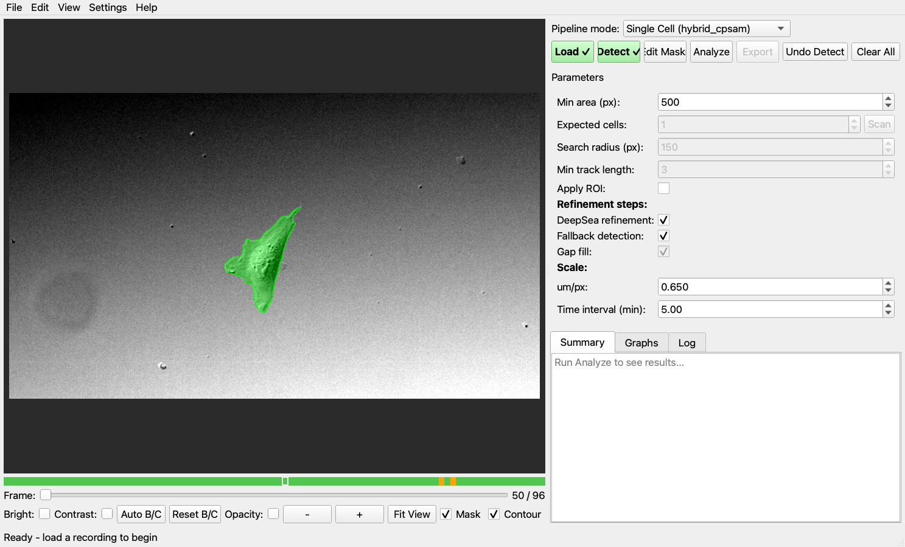
*Cell detection with cpsam + DeepSea union. Green overlay shows detected cell boundary.*

- **Image viewer** with brightness/contrast, pan/zoom, mask overlay
- **ROI selector** — rectangle, ellipse, or polygon regions
- **Frame navigator bar** — color-coded detection quality per frame
- **20 graph types** including trajectory, MSD, edge kymograph, VAMPIRE shape modes
- **Export dialog** — masks, metrics, plots (PNG/SVG/PDF), overlay TIFFs

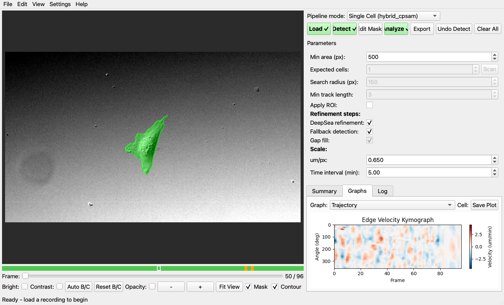
*Edge velocity kymograph showing protrusion (red) and retraction (blue) over time.*

## Example Results

| Trajectory | Speed | Edge Kymograph |
|:---:|:---:|:---:|
| 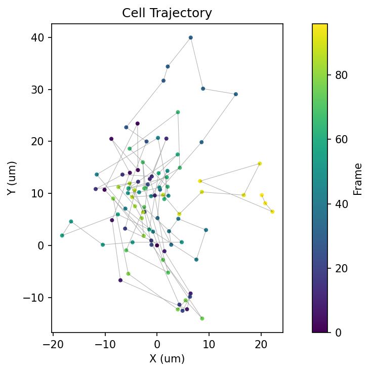 | 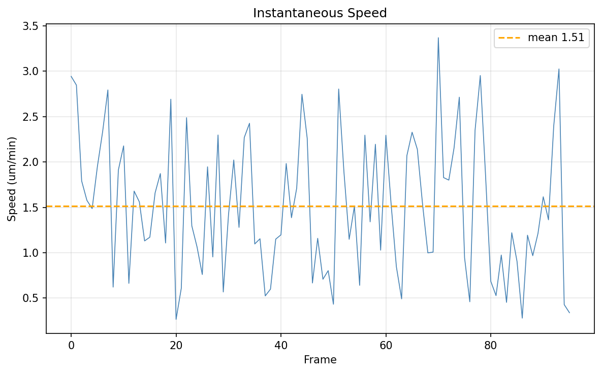 | 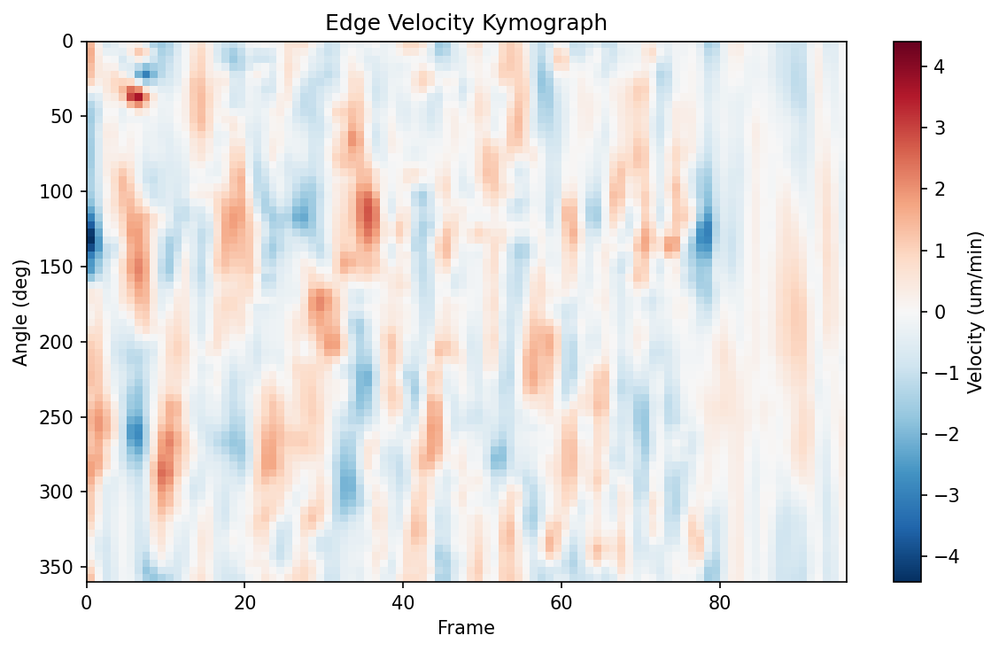 |

| Shape Panel | MSD | Area |
|:---:|:---:|:---:|
| 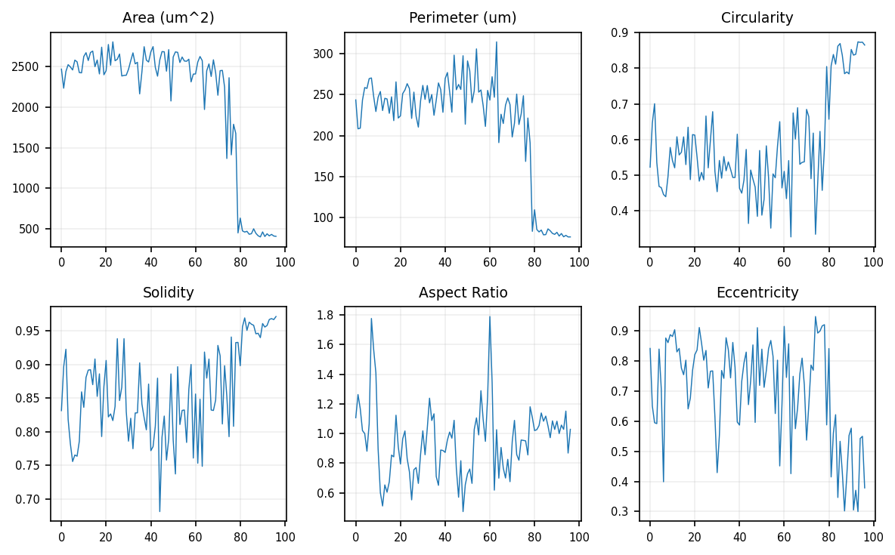 | 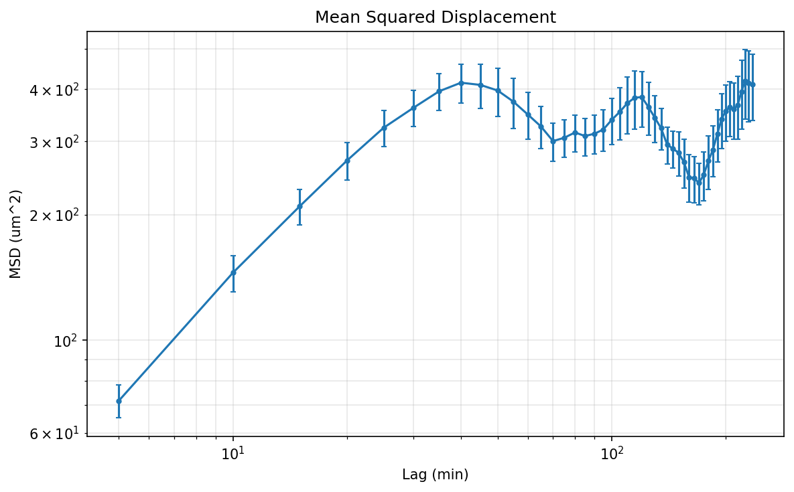 | 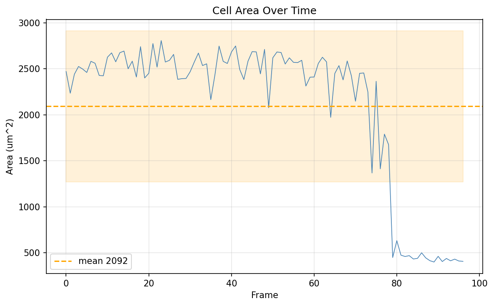 |

## Multi-Cell Tracking

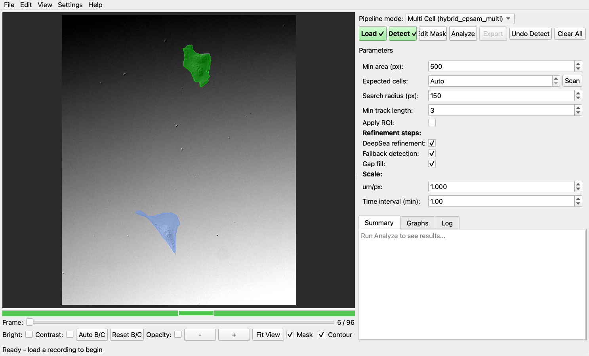
*Multi-cell mode: each tracked cell gets a distinct color (green, red, blue). Per-cell analysis available.*

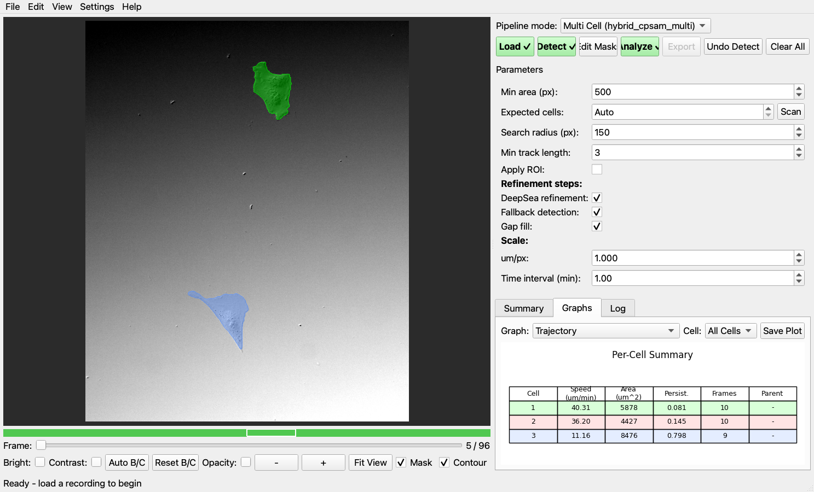
*Per-cell summary table with migration speed, area, persistence, and division detection.*

## ROI Selection

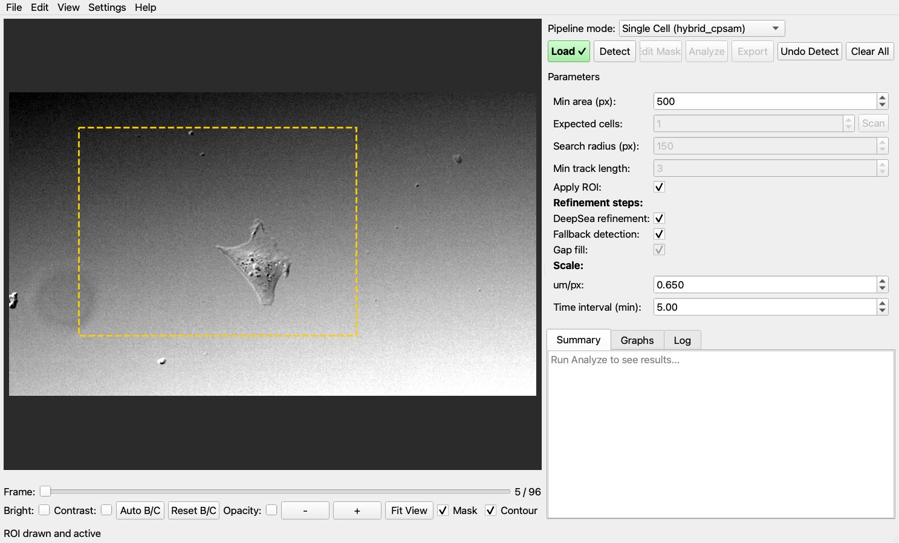
*Rectangle ROI restricts detection to a region of interest. Ellipse and polygon shapes also supported.*

## Tracking & Comparison GUI

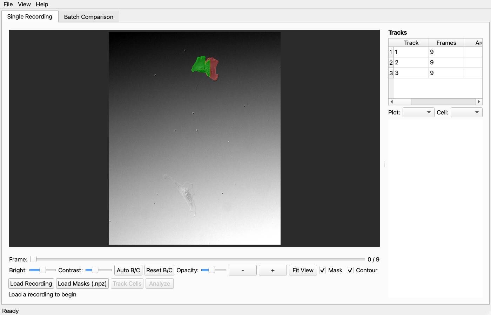
*Single recording view: per-cell tracking with track table showing frames, area, and speed per cell.*

## Statistical Comparison

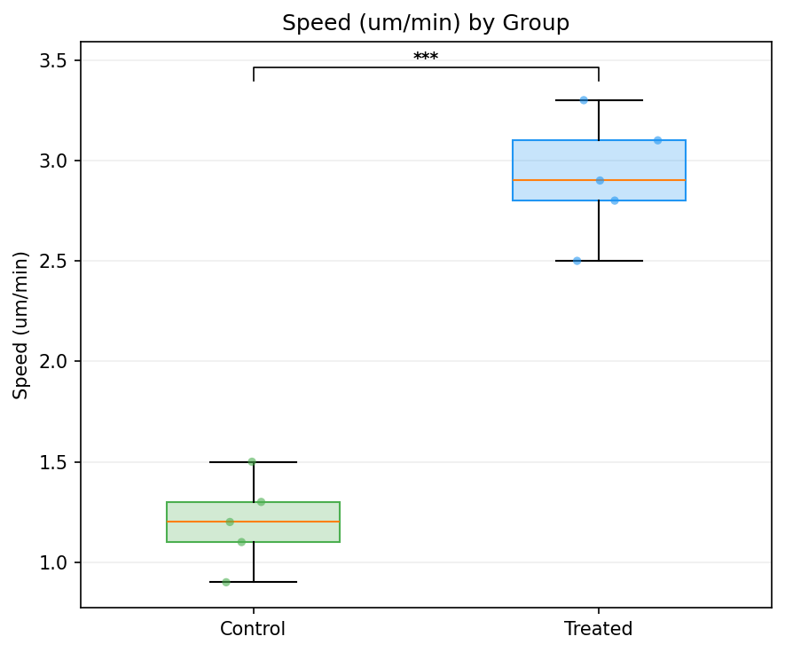
*Box plot with individual data points and significance brackets (*** p < 0.001).*

## Batch Comparison

Process multiple recordings organized by treatment folder:
```
experiment/
  control/
    cell1.tif + cell1.json
    cell2.tif + cell2.json
  treated/
    cell3.tif + cell3.json
```

Produces per-recording results + group statistical comparisons with:
- Box/violin plots with significance brackets (*, **, ***)
- Welch's t-test + Mann-Whitney U (2 groups)
- One-way ANOVA + Kruskal-Wallis + Bonferroni post-hoc (3+ groups)
- Cohen's d effect size

## Data Format

Each recording needs a video file and a JSON sidecar with scale info:

```json
{
  "name": "My Cell",
  "um_per_px": 0.65,
  "time_interval_min": 5.0
}
```

Supported video formats: `.tif`, `.tiff`, `.mp4`, `.avi`, `.mov`

## Project Structure

```
cellscope/
├── main_suite.py          ← Unified launcher
├── main_focused.py        ← Detection & Analysis
├── main_batch.py          ← Batch Processing
├── main_tracking.py       ← Tracking & Comparison
├── main_editor.py         ← Mask Editor
├── main_training.py       ← Model Training
├── setup_wizard.py        ← Environment setup
├── core/                  ← Analysis pipeline (32 modules)
├── gui/                   ← Shared GUI components
├── gui_focused/           ← Detection GUI
├── gui_batch/             ← Batch GUI
├── gui_tracking/          ← Tracking GUI
├── gui_editor/            ← Editor GUI
├── gui_training/          ← Training GUI
├── output/                ← Result writers
├── data/
│   ├── models/            ← Trained models
│   ├── manual_gt/         ← Ground truth masks
│   └── examples/          ← Example recordings
└── docs/                  ← User manual, pipeline description
```

## Requirements

- Python 3.10
- PyTorch 2.0+ with CUDA (Linux/Windows) or MPS (macOS)
- Cellpose 4.1+ (for cpsam ViT detection)
- See `requirements.txt` for full list

## Distribution

```bash
# Create a full zip for sharing (includes models + data)
python make_dist.py

# Create a code-only zip (small, models downloaded on first run)
python make_dist.py --code-only
```

## Citation

If you use CellScope in your research, please cite the original software (see below)

## License

MIT License. See [LICENSE](LICENSE) for details.

## Acknowledgments

CellScope builds on:
- [Cellpose](https://github.com/MouseLand/cellpose) (Stringer et al., Nature Methods 2021)
- [Cellpose-SAM](https://github.com/MouseLand/cellpose) (Pachitariu et al., 2024)
- [DeepSea](https://github.com/abzargar/DeepSea) (Zargari et al., Cell Reports Methods 2022)
- [MedSAM](https://github.com/bowang-lab/MedSAM) (Ma et al., Nature Communications 2024)
- [VAMPIRE](https://github.com/kukionfr/VAMPIRE_analysis) (Lam et al., Nature Protocols 2021)
