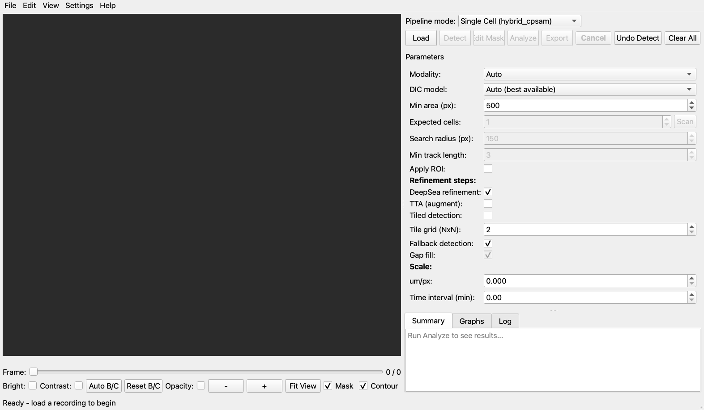
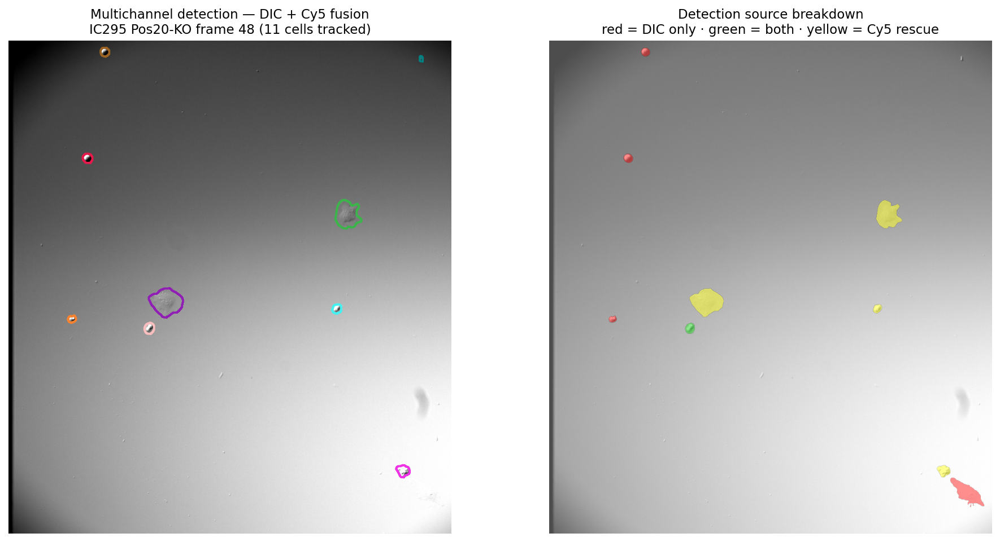

# CellScope

**Automated cell detection, tracking, and analysis for DIC, phase-contrast, and DIC+fluorescence time-lapse microscopy.**

CellScope detects cell boundaries, tracks cells across frames, and quantifies migration, morphology, and edge dynamics — for single-cell, multi-cell, and multi-channel (DIC + actin) recordings. Five specialised GUIs cover the full workflow from raw recordings to publication-ready figures and statistical comparisons.


*End-to-end workflow on a phase-contrast keratinocyte recording: cpsam detection → Hungarian tracking → per-cell migration metrics → group statistics.*

## Key Features

- **Auto-selecting detection backbone** — for each recording the pipeline samples 5 frames, counts cells, and picks `cpsam_dic` (DIC fine-tune, single-cell-biased) when the median is <1.5 cells/frame, or raw `cpsam` (ViT, handles touching cells) for crowded fields.
- **Multi-channel (DIC + Cy5) pipeline** — F-actin / SiR-actin Cy5 channel used to filter DIC false positives (multi-metric cellularity test) and recover cells DIC missed (Tier 1–4 fail-safes).
- **DIC↔Cy5 channel alignment** — sub-pixel offset measured per recording via cellpose-centroid matching, applied before detection.
- **Four-phase track gap fill** — cpsam(augment=True) → CP3 + MedSAM + DeepSea fallback → **SAM2 video propagation** → translation-only fill. 100% gap-fill rate on tested recordings.
- **Cell-state classification** — per cell-frame: balled (mitotic / rounded) vs attached (spread) vs transitional, with per-state motility metrics (removes the dividing-cell composition confound).
- **VAMPIRE shape modes** — PCA eigenshapes + K-means clustering + Shannon entropy heterogeneity (Lam et al., Nature Protocols 2021).
- **Statistical comparison** — t-test, Mann-Whitney, ANOVA, Kruskal-Wallis, Cohen's d, Bonferroni post-hoc.
- **Single source of truth for defaults** — every GUI + worker reads from `core/pipeline_defaults.py`. No drift between focused/batch/tracking analysis of the same recording.
- **Full reproducibility** — every analysis run writes `RUN_METADATA.{md,json}` with source path + checksum, all params, env versions, git commit, and the exact CLI to reproduce.
- **Cross-platform** — macOS (MPS GPU), Linux/Windows (CUDA GPU), CPU fallback.
- **5 specialised GUIs** + unified launcher, 107/107 headless test coverage.

## Pipeline Overview

```
Recording (.tif / .mp4)              ← single- or multi-channel
  │
  ▼
┌─────────────────────────────────────────────────────┐
│ PRE-DETECTION (core/unified_detection.py)           │
│  1. DIC↔Cy5 alignment (multichannel only)           │
│     - cellpose centroid matching, sub-pixel offset  │
│  2. Auto-downsample (max-dim heuristic)             │
│     - <900 px:   no change                          │
│     - 900-1500:  2× (3× speedup, ~3% IoU cost)      │
│     - ≥1500:     2× (5× speedup, no IoU cost)       │
│  3. Convert µm thresholds → per-recording px        │
│     (min_area_um2 → min_area_px from um_per_px)     │
│  4. Auto-pipeline-select                            │
│     - sample 5 frames, count cells via cpsam_dic    │
│     - median <1.5 → cpsam_dic (tighter boundaries)  │
│     - median ≥1.5 → raw cpsam (handles touching)    │
└─────────────┬───────────────────────────────────────┘
              │
              ▼
┌─────────────────────────────────────────────────────┐
│ DETECTION                                           │
│  ★ Auto-selected backbone:                          │
│      cpsam_dic (CP4 ViT fine-tune) OR raw cpsam     │
│  → DeepSea union (fills under-segmented regions,    │
│    removes debris via largest-CC + fill-holes)      │
│  → Fallback: cellpose+MedSAM+DeepSea (CP3)          │
│    only for frames the primary missed               │
└─────────────┬───────────────────────────────────────┘
              │
              ▼
┌─────────────────────────────────────────────────────┐
│ MULTICHANNEL FUSION + FILTER (Cy5 only)             │
│  - Cy5 fusion (Tier 1): detect on Cy5 too, merge    │
│  - Cy5 recovery (Tier 2): crop+re-detect at Cy5+    │
│    regions not covered by DIC mask                  │
│  - Cy5 false-positive filter (Tier 4) — default     │
│    "multi-metric": drop tracks failing ≥2/3 of      │
│    {z-score, inside/outside ratio, % positive}      │
└─────────────┬───────────────────────────────────────┘
              │
              ▼
┌─────────────────────────────────────────────────────┐
│ TRACKING (multi-cell)                               │
│  Hungarian assignment (scipy linear_sum_assignment) │
│  → Gap-tolerant (max_gap_frames=15 by default)      │
│  → Spawn new tracks for cells entering FoV          │
│  → Division detection (area-ratio heuristic)        │
└─────────────┬───────────────────────────────────────┘
              │
              ▼
┌─────────────────────────────────────────────────────┐
│ GAP FILL (per track, 4-phase cascade)               │
│  Phase 1: cpsam(augment=True) — 4-rotation TTA      │
│  Phase 2: CP3 + MedSAM + DeepSea (subprocess)       │
│  Phase 3: SAM2 video propagation (memory attention) │
│  Phase 4: translation-only fill (last resort)       │
│                                                     │
│  100% fill rate on tested recordings (41/41 gaps)   │
└─────────────┬───────────────────────────────────────┘
              │
              ▼
┌─────────────────────────────────────────────────────┐
│ DIVISION ANNOTATION (post-hoc)                      │
│  swelling → ball → halve → 2 daughters grow         │
│  Sets parent_id on daughters; writes divisions.json │
└─────────────┬───────────────────────────────────────┘
              │
              ▼
┌─────────────────────────────────────────────────────┐
│ ANALYSIS (per cell)                                 │
│  Migration:  speed, MSD (D, α fit), persistence,    │
│              direction autocorrelation              │
│  Morphology: area, perimeter, circularity,          │
│              solidity, AR, eccentricity             │
│  Edge:       protrusion/retraction velocity,        │
│              angular kymograph                      │
│  Quality:    boundary confidence, consecutive IoU   │
│  State:      balled / attached / transitional       │
│              + per-state motility                   │
│  VAMPIRE:    shape modes, distribution,             │
│              eigenshapes, Shannon entropy           │
└─────────────┬───────────────────────────────────────┘
              │
              ▼
┌─────────────────────────────────────────────────────┐
│ OUTPUT                                              │
│  Masks (.npz)  Metrics (.json)  Overlay TIFFs       │
│  20 plot types  Per-cell CSV  Per-state CSV         │
│  RUN_METADATA.{md,json} (always written)            │
│  Batch group CSVs + box/violin plots                │
└─────────────────────────────────────────────────────┘
```

This entire chain lives in **`core/unified_detection.detect_recording(...)`** — one function, called by both the focused GUI worker (`mode="auto"`) and the runner script (`scripts/run_pipeline_on_gt_recording.py`). The GUI and CLI produce **identical output by construction**.

## Quick Start

### macOS / Linux

```bash
# 1. Install Miniconda if you don't have it:
#    https://docs.conda.io/en/latest/miniconda.html

# 2. From the cellscope/ directory, create both conda envs:
bash install.sh

# 3. Download the cpsam_dic model (1.1 GB) — needs the Drive URL
#    given to you by the project maintainer:
conda run -n cellpose python download_models.py \
    --url 'https://drive.google.com/file/d/<FILE_ID>/view'

# 4. Launch (cellpose4 is the canonical env for end-to-end runs):
conda activate cellpose4
python main_suite.py
```

### Windows

```bat
REM 1. Install Miniconda for Windows (one-time):
REM    https://docs.conda.io/en/latest/miniconda.html

REM 2. Open "Anaconda Prompt", `cd` into the cellscope folder, then:
install.bat

REM 3. Download the cpsam_dic model (1.1 GB):
conda run -n cellpose python download_models.py ^
    --url "https://drive.google.com/file/d/<FILE_ID>/view"

REM 4. Launch:
conda activate cellpose4
python main_suite.py
```

`install.bat` / `install.sh` create two conda envs:
- **`cellpose4`** — cellpose 4.1.1 + cpsam_dic ViT fine-tune. **Default env** for running the full pipeline (the auto-selector may pick either backbone).
- **`cellpose`** — cellpose 3.1.1.1 fallback env (CP3 models, MedSAM, DeepSea). Invoked automatically via subprocess for Phase-2 gap fill, etc.

The smaller CP3 fine-tunes (`cellpose_dic`, `cellpose_dic_v3`, `cellpose_combined_robust`, ~25 MB each) ship with the source. The 1.1 GB `cpsam_dic` ViT fine-tune is downloaded separately (the file exceeds GitHub's 100 MB file limit so it lives on Google Drive).

#### GPU support

- **Apple Silicon (M-series)**: works out of the box via PyTorch MPS.
- **NVIDIA (Linux / Windows)**: install a CUDA-flavored torch after the base install:
  ```bash
  conda activate cellpose4
  pip install torch==2.7.0 --index-url https://download.pytorch.org/whl/cu121
  ```
  (replace `cu121` with `cu118` etc. to match your CUDA version)
- **CPU only**: works but slow on cpsam ViT (~30 s/frame vs ~2 s on GPU).

## Applications

| Application | Launch command | Purpose |
|---|---|---|
| **Suite Launcher** | `python main_suite.py` | Unified launcher (works from any env) |
| **Detection & Analysis** | `python main_focused.py` | Single-recording load → detect → edit → analyse → export |
| **Batch Processing** | `python main_batch.py` | Multiple recordings + group CSV summaries |
| **Tracking & Comparison** | `python main_tracking.py` | Per-cell tracking + statistical group comparison |
| **Mask Editor** | `python main_editor.py` | View / edit / create cell masks (multi-cell labels) |
| **Model Training** | `python main_training.py` | Fine-tune cellpose on your data |

All five GUIs **read identical defaults** from `core/pipeline_defaults.py::DEFAULTS` — analysing the same recording through any GUI produces the same result.

## Detection & Analysis GUI

The main workflow: **Load → Detect → Edit Masks → Analyze → Export**


*The Detection & Analysis GUI after running detection + analysis on the single-cell phase-contrast demo. Left: viewer with cpsam + DeepSea contour overlay. Right: pipeline state, parameters (auto-resolved from the recording's um/px), and summary metrics.*


*Single-cell phase-contrast detection on the bundled demo recording. Red contour = cpsam + DeepSea prediction.*

- **Image viewer** with brightness/contrast, pan/zoom, mask overlay
- **ROI selector** — rectangle, ellipse, or polygon regions, persists across frames
- **Frame navigator bar** — color-coded detection quality per frame
- **Drag-and-drop** loading for .tif / .mp4 recordings and `.cellscope` project files
- **20 graph types** including trajectory, MSD, edge kymograph, VAMPIRE shape modes
- **Export dialog** — masks (.npz), metrics (.json), plots (PNG/SVG/PDF), MP4 overlay video, per-cell CSV, per-state CSV, RUN_METADATA.{md,json}


*Edge velocity kymograph: angular sector × time, red = protrusion, blue = retraction.*

## Example Results

All graphs come from one tracked cell in a real 97-frame phase-contrast keratinocyte recording. Your own analyses produce equivalent plots from your data.

| Trajectory | Speed | Edge Kymograph |
|:---:|:---:|:---:|
|  |  |  |

| Shape Panel | MSD | Area |
|:---:|:---:|:---:|
|  |  |  |

## Multi-Cell Tracking


*Multi-cell phase-contrast: each tracked cell gets a distinct colour. The Hungarian tracker preserves cell identity across all frames, with the 4-phase gap-fill cascade recovering cells that briefly disappear.*


*Per-cell migration paths over a 60-frame window. Colour = cell, circle = start, square = end.*

**Tracker benchmark on CTC DIC-C2DH-HeLa**:

| Tracker | DET | TRA | SEG |
|---|---:|---:|---:|
| **Hungarian (ours)** | 0.936 | **0.929** | 0.860 |
| Trackastra (transformer) | 0.935 | 0.847 | 0.860 |

Hungarian wins on TRA by 0.08 — fewer edge-addition errors. Both clear the 0.85 ship criterion.

## DIC recordings


*The DIC pipeline (cpsam_dic + min_area filter + per-cell DeepSea refinement) handles cropped DIC keratinocyte recordings. The debris filter automatically drops small false-positive blobs.*

**DIC detection benchmarks** (head-to-head, 90 stratified frames per test):

| Test set | cellpose_dic_v3 | cpsam_dic v1 | **cpsam_dic v2** |
|---|---:|---:|---:|
| In-domain 526² DIC GT | 0.740 | 0.795 | **0.826** |
| Out-of-domain DIC crops | 0.279 | 0.697 | **0.754** |
| Detection rate (in-domain) | 95% | 100% | **100%** |
| Detection rate (OOD) | 42% | 88% | **96%** |

## Multi-channel recordings (DIC + actin)


*Multi-channel pipeline on IC295 Pos20-KO: 11 cells detected and tracked. Left panel = DIC + per-cell coloured contours. Right panel = detection source breakdown (red = DIC only, green = both channels, yellow = Cy5-rescue). Cropped to the cell-containing region.*

For recordings with both DIC and a fluorescent F-actin probe (e.g. SiR-actin in the Cy5 channel), CellScope provides a dedicated **multi-channel pipeline** that uses the actin signal as a ground-truth filter and recovery prior.

**Pipeline stages** (all inside `core/unified_detection.detect_recording`):

1. **DIC↔Cy5 alignment** (`core/channel_alignment.py`) — cellpose locates cell centroids in each channel; Hungarian matching gives a sub-pixel translation offset, applied to Cy5 before any further processing. Skipped when offset < 1 px.
2. **Auto-downsample** — same heuristic for both channels.
3. **Detection on DIC** — auto-selected cpsam_dic or raw cpsam.
4. **Cy5 fusion (Tier 1)** — optionally also run cpsam directly on Cy5 as a parallel detection and merge into DIC labels (recovers cells visible in fluorescence but missed by the conservative DIC model).
5. **Cy5 recovery (Tier 2)** — find Cy5+ regions not covered by any DIC mask, crop the DIC there, re-run cpsam(TTA) to recover cells the base model missed.
6. **Cy5 multi-metric filter (Tier 4)** — drop tracks where the Cy5 signal does not pass the cellularity test (default: ≥2/3 of {z-score, inside/outside ring ratio, fraction-positive coverage}). Tracks failing all 3 are debris / vignette artefacts.
7. **Track gap fill** — Cy5 evidence at the interpolated centroid feeds Tier 3 (cpsam on Cy5 crop).

**Cy5 filter modes** (selectable in the GUI dropdown): off / conservative / conservative-strict / adaptive / adaptive-loose / **multi-metric (default)** / composite-score / consensus / temporal-stability / manual-threshold. Multi-metric is the default — track is REAL if ≥2/3 of {z-score, inside/outside ring ratio, fraction-positive coverage} pass. Tune interactively with `scripts/cy5_filter_tuner.py` (live overlay updates as you slide).

### Use multichannel from the GUI

Both the **focused GUI** (`main_focused.py`) and the **batch GUI** (`main_batch.py`) handle multichannel TIFFs:

* **Focused GUI** — drop a multi-channel `.ome.tif` onto the Single-Recording tab. CellScope auto-detects the channel count and pops up a dialog asking which channel is DIC and which is the fluorescence label (defaults: DIC=ch1, Fluo=ch0 — matches IC295). After loading, the two Cy5 controls in the Parameters panel become enabled.
* **Batch GUI** — under "Pipeline Settings", check **Multichannel** and set the **DIC channel** + **Fluo channel** indices. Cy5 recovery is on by default; the Cy5 filter dropdown applies the same Tier-4 strategies above per recording.

### Use multichannel from the command line

```bash
# Run the full pipeline on a GT recording. Auto-aligns, auto-downsamples,
# auto-selects backbone, applies Cy5 filter, and writes RUN_METADATA:
conda run -n cellpose4 python scripts/run_pipeline_on_gt_recording.py \
    data/ic295_gt_full/Pos7_WT

# After hand-labelling GT candidates, benchmark vs DIC-only baseline:
conda run -n cellpose4 python scripts/bench_multichannel.py \
    --candidates data/ic295_gt/candidates \
    --out-dir results/ic295_eval
```

## Ground-truth evaluation

CellScope ships with a registry of hand-labelled GT recordings in `data/ic295_gt_full/` (multichannel) and `data/legacy_gt/` (single-channel). Run-the-pipeline + evaluate-vs-GT in one command:

```bash
conda run -n cellpose4 python scripts/run_pipeline_on_gt_recording.py \
    data/ic295_gt_full/Pos20_KO
# → produces masks.npz, divisions.json, fusion_diagnostic.png,
#   RUN_METADATA.{md,json}, run_summary.txt under pipeline_results/

python scripts/evaluate_against_gt.py data/ic295_gt_full/Pos20_KO
# → evaluation/report.md with per-frame F1, mean IoU, ID consistency,
#   per-GT-cell tracking
```

**Current GT aggregate** (8 recordings, 227 annotated frames, see `data/gt_evaluation_summary.md`):

| Recording | Genotype | Frames | Mean IoU | F1@.5 | ID cons. | GT divisions caught |
|---|---|---:|---:|---:|---:|---:|
| Pos7_WT | WT | 10 | 0.844 | 0.82 | 100% | — |
| Pos20_KO | KO | 10 | 0.839 | 0.85 | 95% | — |
| Pos30_GOF | GOF | 10 | 0.848 | 0.84 | 92% | — |
| Pos39_OT | OT | 10 | 0.855 | 0.95 | 97.78% | 1 / 1 ✓ |
| Pos51_Y1 | Y1 | 10 | 0.753 | 0.90 | 83.33% | 1 / 1 ✓ |
| ignasi_3_cells_control | ctrl | 97 | 0.820 | 0.87 | 93% | — |
| ignasi_control | ctrl | 15 | 0.890 | 0.80 | 100% | — |
| ignasi_control_full | ctrl | 65 | 0.897 | 0.92 | 100% | — |
| **Aggregate** | — | **227** | **0.843** | **0.87** | **95.14%** | **2 / 2 ✓** |

All five IC295 genotypes (WT/KO/GOF/OT/Y1) covered. The division annotator catches **2 of 2 GT-evident divisions** with 0 false positives across the 8 recordings.

**Phase-contrast Ignasi GT (separate 65-frame benchmark)**: mean IoU **0.932**, 65/65 frames > 0.85, min 0.867 (cpsam + DeepSea union).

## Tracking & Comparison GUI


*Tracking GUI: load masks, run Hungarian tracking, view per-cell metrics across the time-lapse. Track table coloured by composite quality score (pale-green/amber/red).*

## Cell-state classification

Each cell-frame is classified as **balled** (mitotic / rounded), **attached** (spread), or **transitional** based on circularity + solidity thresholds. The defaults (`circ≥0.80 ∧ solidity≥0.92` for balled, `circ≤0.55 ∨ solidity≤0.85` for attached) are validated on IC295 and live in `core/cell_state.py::DEFAULT_THRESHOLDS`.

Per-state motility metrics are written to the export — stratifies migration speed, MSD, persistence by state to **remove the dividing-cell composition confound**. Particularly important when comparing genotypes that differ in mitotic fraction.

## Cell-division annotation

CellScope detects mitotic divisions post-hoc from the tracked label stack using a **biology-aware signal**: pre-mitotic swelling (peak area in a lookback window) → mitotic rounding (balled / transitional state) → parent mask halves vs peak → **both daughters grow ≥30% of peak within 5 frames** → daughter persists ≥4 consecutive frames → mass conservation against pre-split peak. Multiple filters must all pass (no single high-scoring weak link).

Daughters often **stay in contact for several frames** after the parent's mask halves (the tracker sees one merged blob until they separate), so the daughter's first-track-spawn frame is typically 3–6 frames after the algorithm's "split" frame. Both are recorded.

The annotator sets `parent_id`, `division_score`, `division_frame` on daughter tracks, and writes a `divisions.json` sidecar next to `masks.npz` containing candidates + a `track_lineage` table. Standalone audit tool: `scripts/annotate_divisions.py <recording_dir> [...]` also renders 9-frame strip PNGs per candidate (parent red, daughter cyan, peak + split frames labelled) + a per-track area-over-time timeseries + classifiable rejected near-misses, all under `results/divisions/<recording>/`.

## Group analysis (batch mode)

Process multiple recordings organised by group folder:

```
experiment/
  group_A/
    rec1.tif + rec1.json
    rec2.tif + rec2.json
  group_B/
    rec3.tif + rec3.json
```

Per-recording outputs (masks, metrics, plots, `RUN_METADATA.{md,json}`) are written under `results/batch/<group>/<recording>/`. The Tracking GUI's Batch Comparison tab applies group-level statistical tests:

- **2 groups**: Welch's t-test + Mann-Whitney U + Cohen's d effect size
- **3+ groups**: one-way ANOVA + Kruskal-Wallis + Bonferroni post-hoc
- Auto parametric / non-parametric selection via Shapiro-Wilk
- Box / violin plots with significance brackets

CellScope provides the tooling; specific biological comparisons are for the user's publication, not the README.

## Pipeline defaults — single source of truth

The May-2026 refactor consolidated **every parameter default** into one canonical source:

- **`core/pipeline_defaults.py::DEFAULTS`** — detection, tracking, refinement, Cy5, VAMPIRE defaults
- **`core/cell_state.py::DEFAULT_THRESHOLDS`** — balled/attached cuts

All five GUIs' initial widget values and all four workers' `params.get(..., FALLBACK)` calls reference these — no hardcoded numbers. The same recording analysed via focused / batch / tracking gets identical filter thresholds, refinement toggles, and Cy5 modes.

For recording-aware physical-unit thresholds, callers use `DEFAULTS.pixel_thresholds(um_per_px, time_interval_min)` which scales `min_area_um2 → min_area_px`, `max_hop_um_per_min × dt → max_hop_px`, etc. for the specific recording.

**Verify drift hasn't crept in**:

```bash
conda run -n cellpose4 python scripts/test_defaults_consistency.py
# → 28/28 checks pass
```

## Reproducibility — RUN_METADATA

Every analysis run (GUI export, batch worker, evaluation script) writes both a human-readable `RUN_METADATA.md` and machine-readable `RUN_METADATA.json` containing:

- Source recording path + SHA256 + n_frames + um_per_px
- Pipeline function name + mode
- **All** params used + a diff against `DEFAULTS` (only the deviations are listed)
- Env info: conda env, python, cellpose, numpy, scipy, skimage, tifffile, torch versions
- Git commit hash if cellscope is git-tracked
- Timestamp started / finished / runtime seconds
- Exact shell command to reproduce the run

You can recreate any analysis from its metadata file alone.

## GUI test coverage

**107/107 checks pass across 7 phases (A–G) covering 6 GUIs** — see `results/comprehensive_gui_tests/FINAL_REPORT.md`.

| Phase | GUI(s) | Checks | Coverage |
|---|---|---:|---|
| A | Detection & Analysis (single-cell) | 59 | load → detect → analyse → 16 graphs → export, B/C, zoom, pan, frame nav |
| B | Detection & Analysis (multi-cell) | 8 | mode switch, multi detection, per-cell analytics, all 20 graphs, cell selector |
| C | ROI + Mask Editor integration | 9 | draw / persist / apply / clear ROI, mask editor send-to-GUI roundtrip |
| D | Batch GUI | 6 | directory scan, recording tree, settings widgets, params dict |
| E | Tracking GUI | 7 | load masks, Hungarian tracking, per-track analysis, track table, plots |
| F | Training + Editor GUIs | 7 | launch, scan data dir, dock panel |
| G | Parameter flow | 11 | params plumb through to detect dict; scale overrides; toggle behaviour |

Run via:
```bash
conda run -n cellpose4 python scripts/test_focused_gui.py       # Phase A
conda run -n cellpose4 python scripts/test_comprehensive_gui.py # Phases B-G
python scripts/aggregate_comprehensive_report.py                 # merge
```

All tests run headless via `QT_QPA_PLATFORM=offscreen`.

## Models

| Model | Type | Trained On | Best For |
|---|---|---|---|
| **cpsam_dic** ★ | ViT (CP4) | 1,000 DIC pairs (Colab fine-tune) | **DIC, current best** (0.826 in-domain, 0.754 OOD) |
| cpsam (default) | ViT (CP4) | General microscopy | Phase-contrast, crowded fields |
| cellpose_dic_v3 | CNN (CP3) | 2,644 standardised 448 px crops | Faster DIC alternative |
| cellpose_dic_v2 | CNN (CP3) | 2,812 DIC pairs (VAMPIRE+GT+CTC) | Legacy DIC |
| cellpose_dic | CNN (CP3) | Our DIC keratinocytes | Original DIC fine-tune |
| cellpose_combined_robust | CNN (CP3) | 5,826 augmented pairs | Noisy / perturbed recordings |
| DeepSea | U-Net | Brightfield / phase-contrast | Boundary refinement |
| MedSAM | SAM-ViT | Biomedical images | Foundation-model fallback refinement |
| SAM2 | ViT + memory | Natural video | Track gap fill (Phase 3) |

## Data Format

Each recording needs a video file and a JSON sidecar with scale info:

```json
{
  "name": "My Cell",
  "um_per_px": 0.65,
  "time_interval_min": 5.0
}
```

For multichannel `.ome.tif`, channel selection is interactive (focused GUI) or via params (batch GUI / scripts).

Supported video formats: `.tif`, `.tiff`, `.mp4`, `.avi`, `.mov`. Project state can also be saved/loaded as `.cellscope` JSON (recording path + per-stage results + UI state).

## Project Structure

Top-level files: `main_*.py` (5 GUI entry points + suite launcher), `install.{sh,bat}`, `environment*.yml`, `download_models.py`. Packages: `core/` (40+ analysis modules), `gui_focused/` / `gui_batch/` / `gui_tracking/` / `gui_editor/` / `gui_training/` (the five GUIs), `gui/` (shared components), `output/`, `scripts/`, `notebooks/`, `docs/`, `data/`.

Key modules to know:
- **`core/unified_detection.py`** — canonical `detect_recording()` used by GUI + scripts
- **`core/pipeline_defaults.py`** — single source of truth for defaults
- **`core/channel_alignment.py`** — DIC↔Cy5 sub-pixel offset
- **`core/multichannel.py`** + `cy5_*.py` — Cy5 fusion / filter / fallback
- **`core/multi_cell.py`** — Hungarian tracker
- **`core/track_gap_fill.py`** — 4-phase gap-fill cascade (incl. SAM2)
- **`core/cell_state.py`** — balled/attached classification

Full module map: see `INTERFACE.md`. Detailed status + benchmark tables: `PROJECT_STATUS.md`. Contributor / agent rules: `CLAUDE.md`. Best-results recommendations per recording type: [`docs/recording_recommendations.md`](docs/recording_recommendations.md).

## Requirements

- Miniconda or Anaconda (managed envs are easier than raw pip)
- Python 3.10 (created automatically by `install.{sh,bat}`)
- PyTorch 2.7 with CUDA (Linux / Windows) or MPS (macOS)
- Cellpose 4.1.1 in the `cellpose4` env (cpsam ViT, **default for end-to-end runs**)
- Cellpose 3.1.1.1 in the `cellpose` env (CP3 fallback subprocess)
- See `environment.yml` and `environment-cellpose4.yml` for full lists.

## Citation

If you use CellScope in your research, please cite the original software (see below).

## License

MIT License. See [LICENSE](LICENSE) for details.

## Acknowledgments

CellScope builds on:
- [Cellpose](https://github.com/MouseLand/cellpose) (Stringer et al., Nature Methods 2021)
- [Cellpose-SAM](https://github.com/MouseLand/cellpose) (Pachitariu et al., 2024)
- [DeepSea](https://github.com/abzargar/DeepSea) (Zargari et al., Cell Reports Methods 2022)
- [MedSAM](https://github.com/bowang-lab/MedSAM) (Ma et al., Nature Communications 2024)
- [SAM2](https://github.com/facebookresearch/sam2) (Ravi et al., 2024) — track gap fill
- [VAMPIRE](https://github.com/kukionfr/VAMPIRE_analysis) (Lam et al., Nature Protocols 2021)
- [Trackastra](https://github.com/weigertlab/trackastra) (Weigert et al., 2024) — alternative tracker

### AI-assisted development

Substantial portions of CellScope's GUI scaffolding, pipeline integration, multichannel fusion logic, test harness, and documentation were developed with the assistance of [Anthropic Claude](https://www.anthropic.com/claude) (Claude Code / Claude Opus). All code was reviewed and validated against ground-truth recordings before being committed; the design decisions, benchmark interpretation, and biological questions remain the user's responsibility.
