# CellScope

**Automated cell detection, tracking, and analysis for DIC and phase-contrast time-lapse microscopy.**

CellScope detects cell boundaries, tracks cells across frames, and quantifies migration, morphology, and edge dynamics — with support for both single-cell and multi-cell recordings. It provides a complete GUI-based workflow from raw recordings to publication-ready figures and statistical comparisons.


*End-to-end workflow on Jesse keratinocyte recordings: cpsam_dic detection → Hungarian tracking → per-cell migration metrics.*

## Key Features

- **Cellpose-SAM (cpsam) detection** — ViT-based cell detection with DeepSea refinement and automatic fallback for missed frames
- **Multi-cell tracking** — Hungarian algorithm with automatic gap filling and cell division detection
- **Interactive mask editor** — Manual correction with multi-cell label support (1-9 cell IDs)
- **Rich analysis** — Migration speed, MSD, persistence, morphology (6 metrics), edge dynamics (protrusion/retraction kymographs), VAMPIRE shape mode analysis
- **VAMPIRE shape modes** — PCA-based contour decomposition, K-means morphological clustering, Shannon entropy heterogeneity scoring (Lam et al., Nature Protocols 2021)
- **Batch processing** — Process multiple recordings grouped by treatment, with automatic group summary CSVs
- **Statistical comparison** — Inter-group analysis with t-test, Mann-Whitney, ANOVA, Kruskal-Wallis, and significance plots
- **Cross-platform** — macOS (MPS GPU), Linux/Windows (CUDA GPU), CPU fallback
- **5 specialized GUIs** + unified launcher

## Pipeline Overview

```
Recording (.tif / .mp4)
  │
  ▼
┌─────────────────────────────────────────────────────┐
│ DETECTION                                           │
│  Cellpose-SAM (cpsam, ViT backbone)                 │
│  → DeepSea union (fills under-segmented regions)    │
│  → Fallback: cellpose + MedSAM + DeepSea            │
│    (for frames cpsam misses)                        │
│  → Gap fill: cpsam(augment=True) + fallback         │
│    (recovers cells lost in internal track gaps)     │
└─────────────┬───────────────────────────────────────┘
              │
              ▼
┌─────────────────────────────────────────────────────┐
│ TRACKING (multi-cell)                               │
│  Hungarian assignment (scipy linear_sum_assignment) │
│  → Gap-tolerant (MAX_GAP=10 frames)                 │
│  → Spawn new tracks for cells entering FoV          │
│  → Division detection (area ratio heuristic)        │
└─────────────┬───────────────────────────────────────┘
              │
              ▼
┌─────────────────────────────────────────────────────┐
│ ANALYSIS (per cell)                                 │
│  Migration: speed, MSD, persistence, direction      │
│  Morphology: area, perimeter, circularity,          │
│              solidity, aspect ratio, eccentricity   │
│  Edge dynamics: protrusion/retraction velocity,     │
│                 angular kymograph                   │
│  Quality: boundary confidence, consecutive IoU      │
│  VAMPIRE: shape modes, mode distribution,           │
│           eigenshapes, Shannon entropy               │
└─────────────┬───────────────────────────────────────┘
              │
              ▼
┌─────────────────────────────────────────────────────┐
│ OUTPUT                                              │
│  Masks (.npz), metrics (.json), overlay TIFFs       │
│  20 plot types (trajectory, MSD, kymograph,         │
│    shape modes, eigenshapes, ...)                   │
│  Batch CSV summaries, group statistical comparison  │
│  Box/violin plots with significance brackets        │
└─────────────────────────────────────────────────────┘
```

## Quick Start

### macOS / Linux

```bash
# 1. Install Miniconda if you don't have it:
#    https://docs.conda.io/en/latest/miniconda.html

# 2. From the cellscope/ directory, create both conda envs:
bash install.sh

# 3. Download the cpsam_dic model (1.1 GB) — needs the Drive URL
#    given to you by the project maintainer:
conda run -n cellpose python download_models.py \
    --url 'https://drive.google.com/file/d/<FILE_ID>/view'

# 4. Launch:
conda activate cellpose
python main_suite.py
```

### Windows

```bat
REM 1. Install Miniconda for Windows (one-time):
REM    https://docs.conda.io/en/latest/miniconda.html

REM 2. Open "Anaconda Prompt", `cd` into the cellscope folder, then:
install.bat

REM 3. Download the cpsam_dic model (1.1 GB):
conda run -n cellpose python download_models.py ^
    --url "https://drive.google.com/file/d/<FILE_ID>/view"

REM 4. Launch:
conda activate cellpose
python main_suite.py
```

`install.bat` / `install.sh` create two conda envs:
- **`cellpose`** — main env with the GUI, CP3 models, and the analysis pipeline.
- **`cellpose4`** — sibling env hosting cellpose 4.x (cpsam ViT). Invoked
  automatically via subprocess whenever the pipeline needs cpsam_dic.

The smaller CP3 fine-tunes (`cellpose_dic`, `cellpose_dic_v2/v3`,
`cellpose_combined_robust`, ~25 MB each) ship with the source. Only the
1.1 GB `cpsam_dic` ViT fine-tune needs the separate download.

#### Sharing CellScope with collaborators

To send the project to someone else:

1. Zip everything **except** `data/training/`, `data/examples/`, and
   `results/` (those are large and not needed at runtime).
2. Include the small `data/models/cellpose_dic*` files (~100 MB).
3. Send the zip + the Google Drive URL for `cpsam_dic` separately.
4. Recipient runs `install.bat` (or `install.sh`) then `download_models.py`
   with the Drive URL.

#### GPU support

- **Apple Silicon (M-series)**: works out of the box via PyTorch MPS.
- **NVIDIA (Linux / Windows)**: install a CUDA-flavored torch after the
  base install:
  ```bash
  conda activate cellpose
  pip install torch==2.7.0 --index-url https://download.pytorch.org/whl/cu121
  ```
  (replace `cu121` with `cu118` etc. to match your CUDA version)
- **CPU only**: works but slow on cpsam ViT (~30 s/frame vs ~2 s on GPU).

## Applications

| Application | Launch command | Purpose |
|---|---|---|
| **Suite Launcher** | `python main_suite.py` | Unified launcher (works from any env) |
| **Detection & Analysis** | `python main_focused.py` | Single-recording pipeline |
| **Batch Processing** | `python main_batch.py` | Multiple recordings + group summaries |
| **Tracking & Comparison** | `python main_tracking.py` | Per-cell tracking + ANOVA statistics |
| **Mask Editor** | `python main_editor.py` | View/edit/create cell masks |
| **Model Training** | `python main_training.py` | Fine-tune cellpose on your data |

## Detection & Analysis GUI

The main workflow: **Load → Detect → Edit Masks → Analyze → Export**

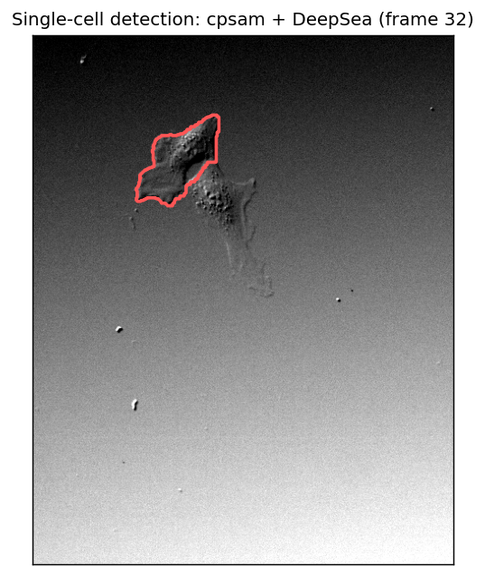
*DIC single-cell detection on a VAMPIRE keratinocyte. Red contour = cpsam_dic + DeepSea prediction.*

- **Image viewer** with brightness/contrast, pan/zoom, mask overlay
- **ROI selector** — rectangle, ellipse, or polygon regions
- **Frame navigator bar** — color-coded detection quality per frame
- **20 graph types** including trajectory, MSD, edge kymograph, VAMPIRE shape modes
- **Export dialog** — masks, metrics, plots (PNG/SVG/PDF), overlay TIFFs

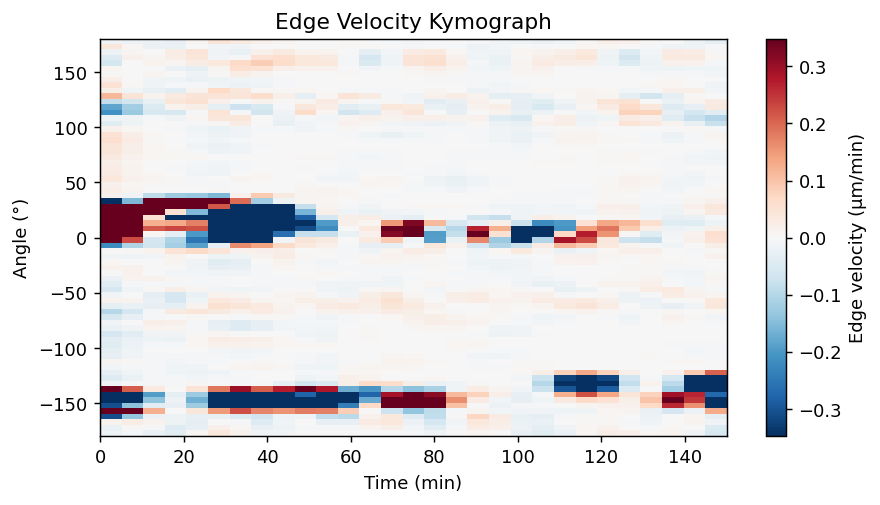
*Edge velocity kymograph: angular sector × time, red = protrusion, blue = retraction.*

## Example Results

All graphs come from a real Jesse `pos17_wt` keratinocyte recording (DIC, 30-frame slice). Replace these in your own analyses with results from your data.

| Trajectory | Speed | Edge Kymograph |
|:---:|:---:|:---:|
| 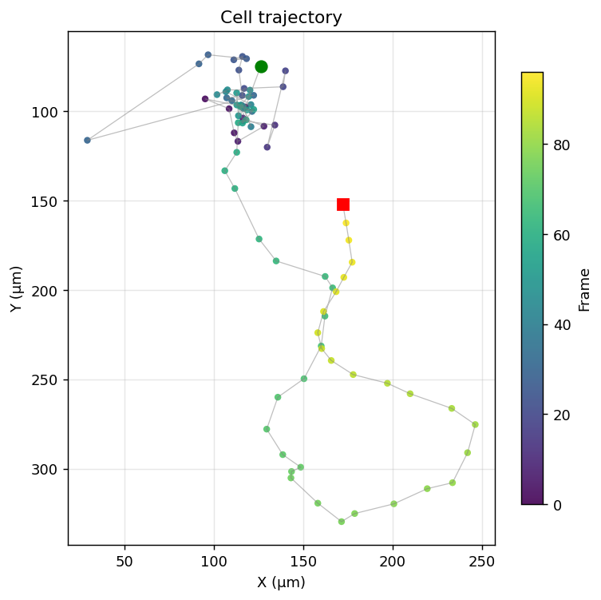 | 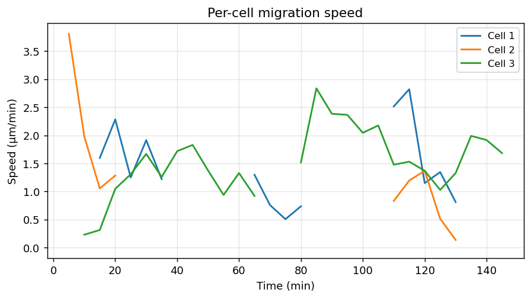 |  |

| Shape Panel | MSD | Area |
|:---:|:---:|:---:|
| 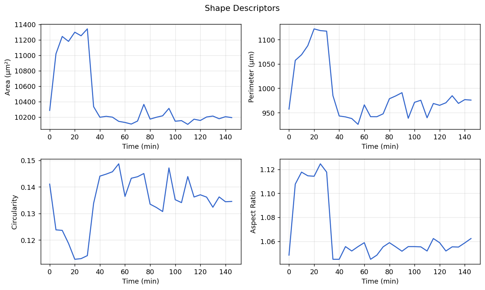 | 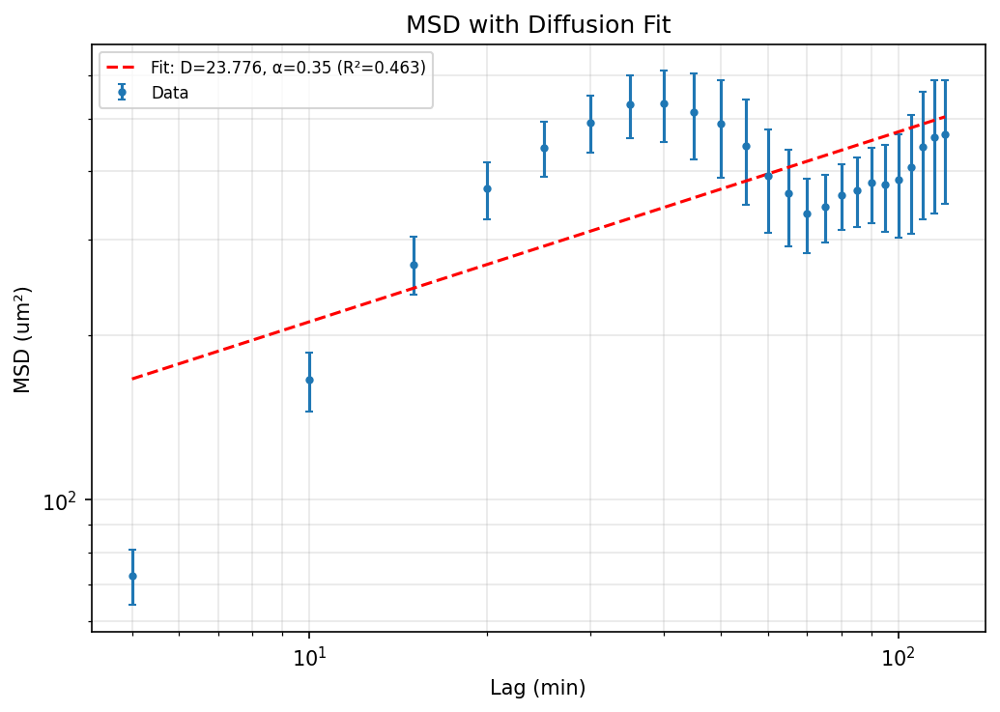 | 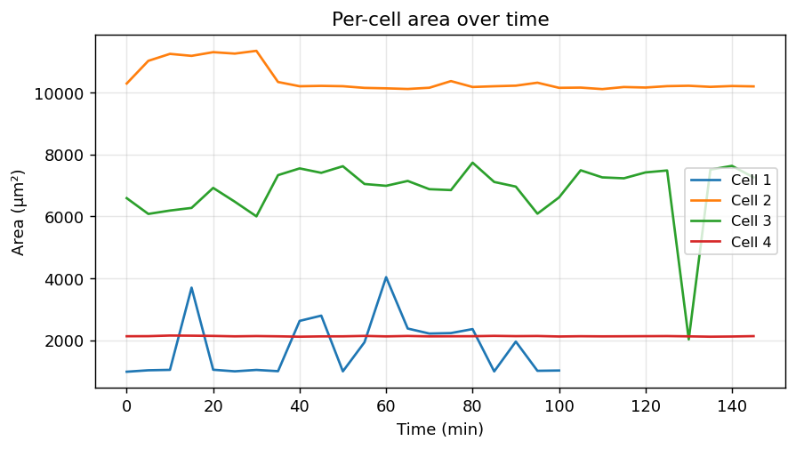 |

## Multi-Cell Tracking

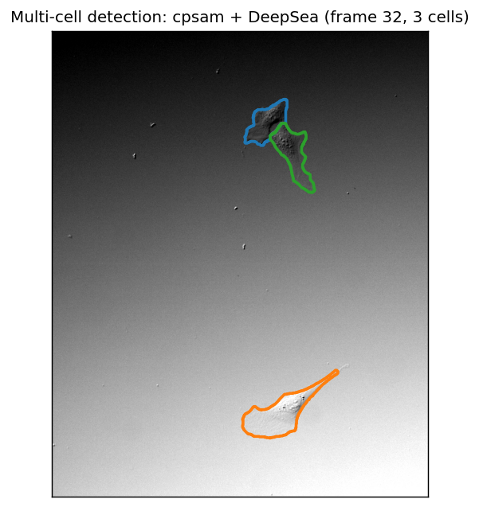
*Multi-cell DIC: each tracked cell gets a distinct color. Hungarian tracker preserves identity across frames.*

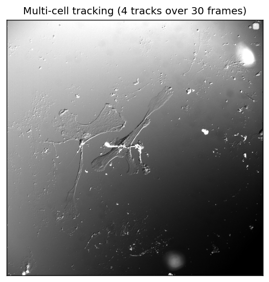
*Per-cell trajectories overlaid on the recording. Green circle = start, red square = end.*

## Phase-Contrast (Ignasi-style) recordings

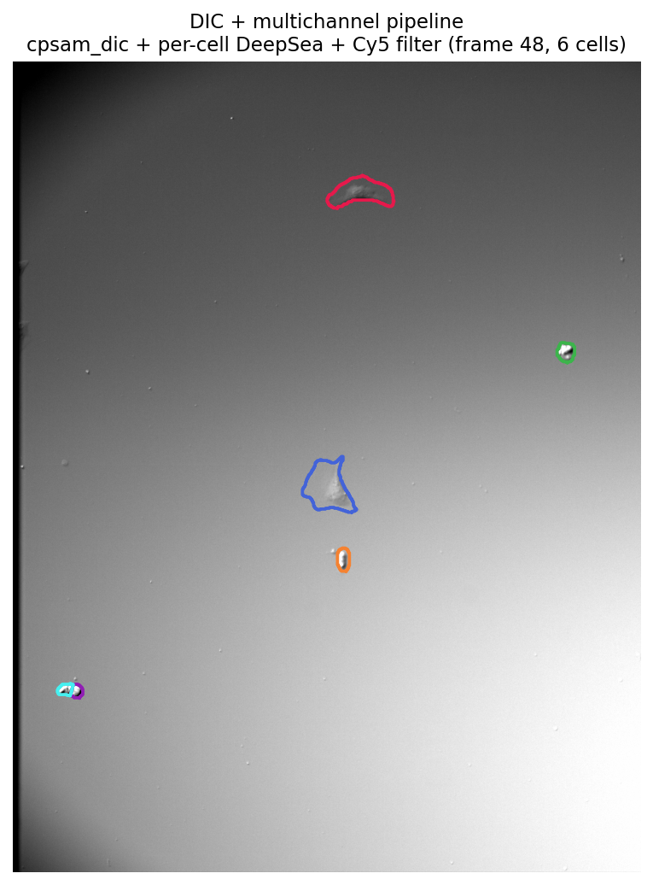
*Default cpsam (no DIC fine-tune) handles phase-contrast cleanly — DeepSea filters debris automatically.*

## Tracking & Comparison GUI

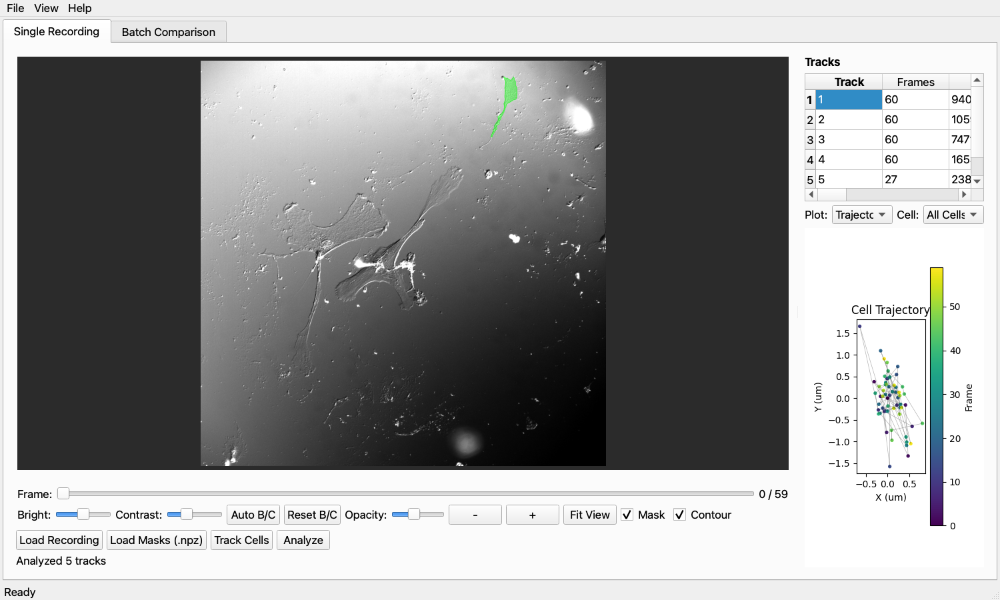
*Tracking GUI: load masks, run Hungarian tracking, view per-cell metrics across the time-lapse.*

## Statistical Comparison

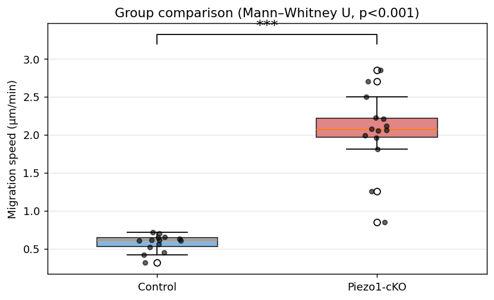
*Box plot with individual data points and significance brackets. Generated automatically from batch comparisons.*

## Batch Comparison

Process multiple recordings organized by treatment folder:
```
experiment/
  control/
    cell1.tif + cell1.json
    cell2.tif + cell2.json
  treated/
    cell3.tif + cell3.json
```

Produces per-recording results + group statistical comparisons with:
- Box/violin plots with significance brackets (*, **, ***)
- Welch's t-test + Mann-Whitney U (2 groups)
- One-way ANOVA + Kruskal-Wallis + Bonferroni post-hoc (3+ groups)
- Cohen's d effect size

## Data Format

Each recording needs a video file and a JSON sidecar with scale info:

```json
{
  "name": "My Cell",
  "um_per_px": 0.65,
  "time_interval_min": 5.0
}
```

Supported video formats: `.tif`, `.tiff`, `.mp4`, `.avi`, `.mov`

## Project Structure

```
cellscope/
├── install.bat / install.sh           ← Cross-platform installer
├── environment.yml                    ← cellpose env spec
├── environment-cellpose4.yml          ← cellpose4 env spec
├── download_models.py                 ← Drive fetcher (cpsam_dic + bundle)
├── make_models_bundle.py              ← Maintainer: build models bundle
├── make_dist.py                       ← Maintainer: build dist zip
│
├── main_suite.py                      ← Unified launcher (start here)
├── main_focused.py                    ← Detection & Analysis
├── main_batch.py                      ← Batch Processing
├── main_tracking.py                   ← Tracking & Comparison
├── main_editor.py                     ← Mask Editor
├── main_training.py                   ← Model Training
│
├── core/                              ← Analysis pipeline (34 modules)
├── gui/                               ← Shared GUI components
├── gui_focused/                       ← Detection GUI
├── gui_batch/                         ← Batch GUI
├── gui_tracking/                      ← Tracking GUI
├── gui_editor/                        ← Editor GUI
├── gui_training/                      ← Training GUI
├── output/                            ← Result writers
│
├── scripts/                           ← Bench / training / eval scripts
│   └── _paths.py                      ← Project-root + benchmark-data helpers
├── notebooks/                         ← Colab training notebooks
│
├── data/
│   ├── models/                        ← cpsam_dic + CP3 fine-tunes + DeepSea
│   ├── manual_gt/                     ← Ground truth masks (optional)
│   └── examples/                      ← Example recordings (optional)
│
├── docs/
│   ├── user_manual.md                 ← How to use the GUIs
│   ├── recording_recommendations.md   ← Best settings per recording type
│   └── pipeline_description.md
│
├── INSTALLATION.md                    ← Setup guide (full)
├── INTERFACE.md                       ← Module map
├── PROJECT_STATUS.md                  ← Current results + benchmarks
└── README.md                          ← This file
```

For best-results recommendations per recording type, see
**[docs/recording_recommendations.md](docs/recording_recommendations.md)**.

## Requirements

- Miniconda or Anaconda (managed envs are easier than raw pip)
- Python 3.10 (created automatically by `install.{sh,bat}`)
- PyTorch 2.7 with CUDA (Linux / Windows) or MPS (macOS)
- Cellpose 3.1.1.1 in the `cellpose` env (CP3 models + GUI)
- Cellpose 4.1.1 in the `cellpose4` env (cpsam ViT)
- See `environment.yml` and `environment-cellpose4.yml` for full lists.

## Citation

If you use CellScope in your research, please cite the original software (see below)

## License

MIT License. See [LICENSE](LICENSE) for details.

## Acknowledgments

CellScope builds on:
- [Cellpose](https://github.com/MouseLand/cellpose) (Stringer et al., Nature Methods 2021)
- [Cellpose-SAM](https://github.com/MouseLand/cellpose) (Pachitariu et al., 2024)
- [DeepSea](https://github.com/abzargar/DeepSea) (Zargari et al., Cell Reports Methods 2022)
- [MedSAM](https://github.com/bowang-lab/MedSAM) (Ma et al., Nature Communications 2024)
- [VAMPIRE](https://github.com/kukionfr/VAMPIRE_analysis) (Lam et al., Nature Protocols 2021)
