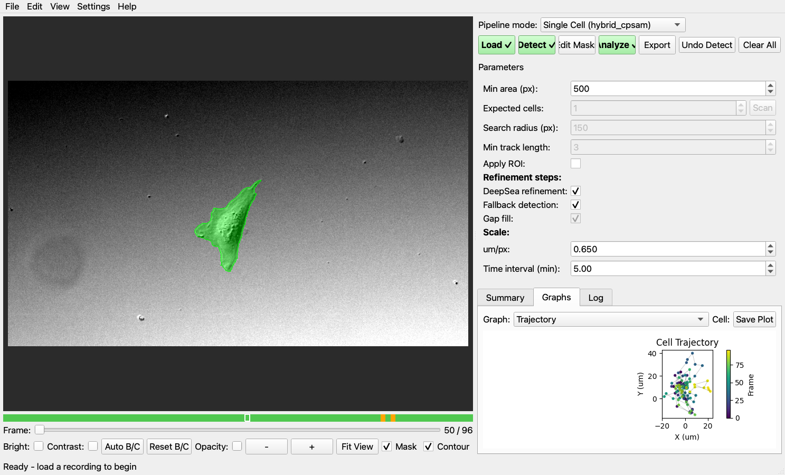
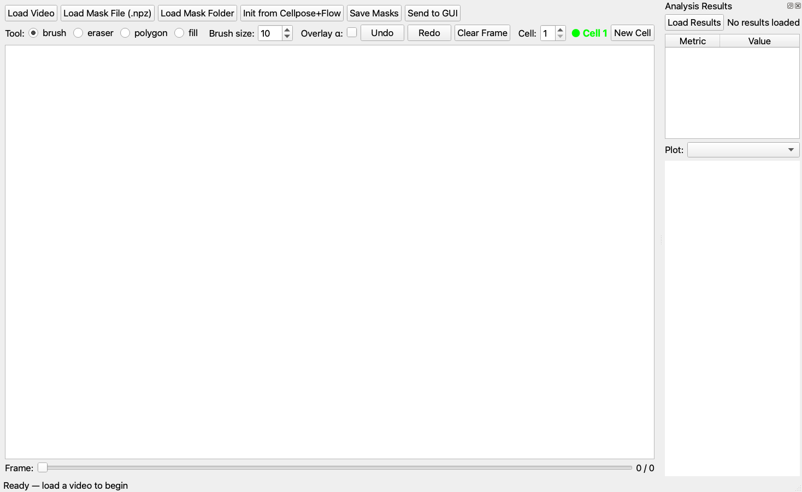
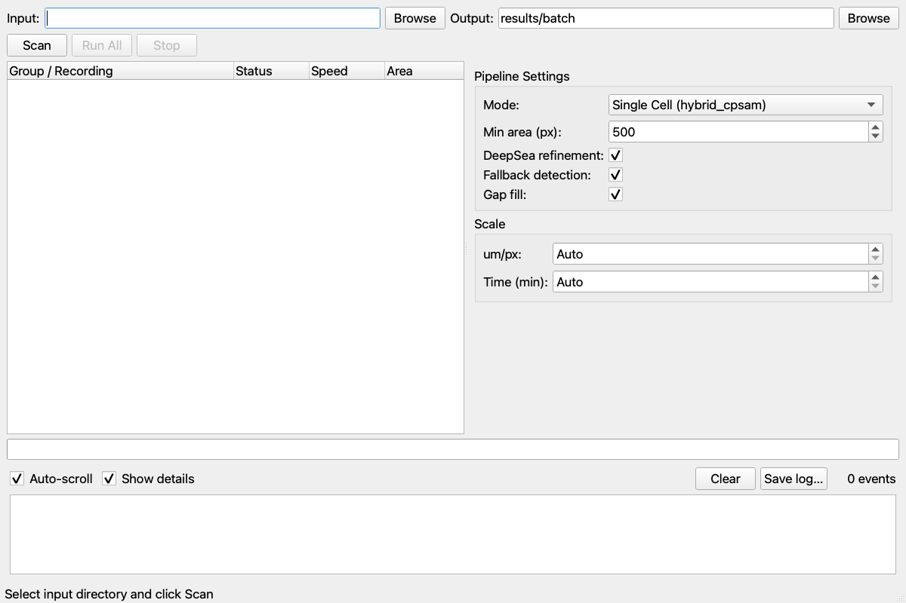
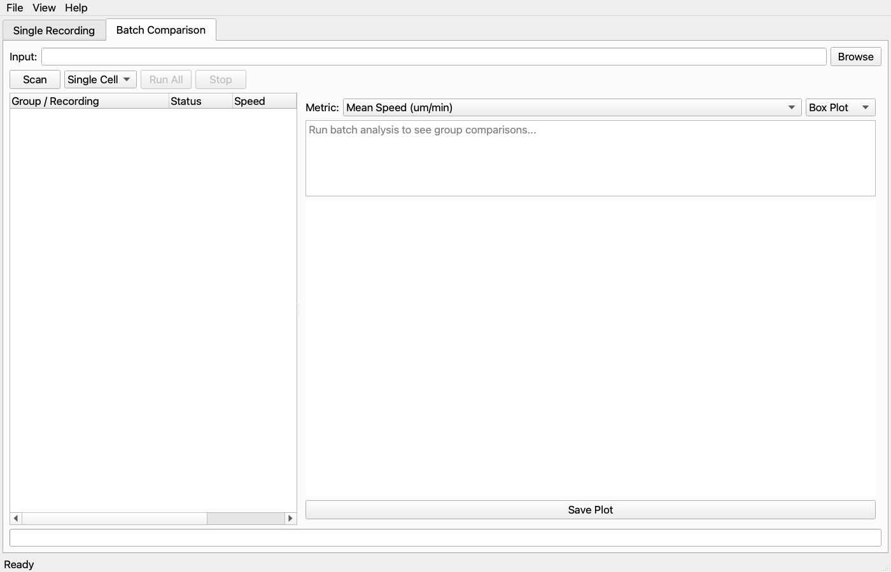
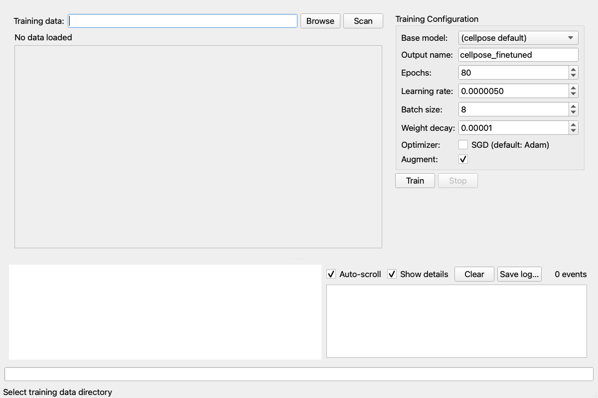

# CellScope — User Manual

## Getting Started

### Launching CellScope

```bash
conda activate cellpose4
python main_suite.py
```

This opens the suite launcher with buttons for each application.
Click any button to open that tool. You can run multiple tools
simultaneously.

### Preparing Your Data

Each recording needs:
1. A video file (`.tif`, `.tiff`, `.mp4`, `.avi`, or `.mov`)
2. A JSON sidecar with the same base name containing scale info:

```json
{
  "name": "My Recording",
  "um_per_px": 0.65,
  "time_interval_min": 5.0
}
```

If no JSON file exists, CellScope uses defaults (1.0 μm/px,
1.0 min/frame).

---

## Detection & Analysis (main_focused.py)

The primary workflow for analyzing a single recording.


*The Detection & Analysis GUI showing a detected cell with mask overlay.*

### Pipeline Stages

**1. Load** — Click Load or drag-and-drop a video file onto the
window. The recording opens in the image viewer. Scale values
(μm/px, time interval) auto-populate from the JSON sidecar.

**2. Detect** — Click Detect to run the hybrid cpsam pipeline.
Progress shows in the status bar. When complete, cell boundaries
appear as colored overlays on the image. The frame navigator bar
(below the image) shows green for detected frames, red for missed,
orange for fallback-rescued.

**3. Edit Masks** (optional) — Click Edit Masks to open the mask
editor. Draw/erase cell boundaries, then click "Send to GUI" to
push corrections back. The analysis will use your edited masks.

**4. Analyze** — Click Analyze to compute migration, morphology,
and edge dynamics. Results appear in the Summary tab (text) and
Graphs tab (14 plot types).

**5. Export** — Click Export to save masks, metrics, plots, and
overlay TIFFs. Choose output format (PNG/SVG/PDF) and DPI.

### Image Viewer Controls

- **Brightness/Contrast**: sliders, or click "Auto B/C" for
  percentile-based stretch
- **Zoom**: scroll wheel (centered on cursor), +/- buttons, or
  "Fit View" to reset
- **Pan**: right-click drag or Ctrl+left-click drag
- **Mask overlay**: toggle with "Mask" checkbox, adjust opacity
- **Contour lines**: toggle with "Contour" checkbox
- **Frame navigation**: slider or left/right arrow keys

### Pipeline Mode

- **Single Cell**: detects one cell per frame (hybrid_cpsam).
  Best for cropped single-cell recordings.
- **Multi Cell**: detects and tracks multiple cells
  (hybrid_cpsam_multi). Automatically handles division events.

### Parameters

- **Min area (px)**: minimum mask area to accept as a real cell
  (smaller = debris). Default 500.
- **Expected cells**: number of cells to keep per frame.
  "Auto" = no filtering. Set to 2 or 3 for multi-cell recordings.
- **DeepSea refinement**: toggle DeepSea union step (default: on)
- **Fallback detection**: toggle cellpose fallback for missed frames
  (default: on)
- **Gap fill**: toggle post-tracking gap fill (default: on,
  multi-cell only)

### ROI Selection

Restrict analysis to a region of interest:
1. Edit menu → Select ROI → choose shape (Rectangle, Ellipse,
   or Polygon)
2. Draw on the image (left-click vertices, right-click to close
   polygon)
3. Check "Apply ROI" in the parameters panel
4. The yellow dashed outline shows the active ROI on all frames

### Graph Types

**Single-cell (10 types):**
Trajectory, Speed vs Time, MSD, Direction Autocorrelation,
Area vs Time, Shape Panel (6 metrics), Edge Kymograph,
Edge Summary Bar, Boundary Confidence, Consecutive IoU

**Multi-cell comparison (4 additional):**
Speed Comparison, Area Comparison, Trajectory Comparison,
Cell Summary Table

Select "All Cells" in the Cell dropdown to see overlaid traces
for all tracked cells.


*Trajectory plot colored by frame number, showing cell migration path.*

---

## Mask Editor (main_editor.py)


*Mask editor with results panel dock.*

### Tools

- **B** — Brush: paint cell pixels (left-click drag)
- **E** — Eraser: remove cell pixels
- **P** — Polygon: click vertices, right-click to close and fill
- **F** — Fill: flood-fill connected background region

### Multi-Cell Labels

Press **1-9** to select which cell ID to paint with. Each cell
gets a distinct color (green, red, blue, yellow, magenta, cyan,
orange, purple, lime).

### Keyboard Shortcuts

- **Left/Right arrows**: previous/next frame
- **Ctrl+Z**: undo
- **Ctrl+Shift+Z**: redo
- **Ctrl+S**: save masks

### Saving Masks

Click "Save Masks" to export as:
- PNG stack: `frame_NNNN_masks.png` (uint16, pixel value = cell ID)
- NPZ: `masks.npz` with key "masks"

Click "Send to GUI" to push edits back to the Detection & Analysis
window (if it launched the editor).

---

## Batch Processing (main_batch.py)


*Batch processing window with directory scanner and pipeline settings.*

### Directory Structure

Organize recordings by treatment group:
```
experiment/
  control/
    cell1.tif + cell1.json
    cell2.tif + cell2.json
  treated/
    cell3.tif + cell3.json
```

### Workflow

1. Set input directory → click **Scan** to discover recordings
2. Configure pipeline settings (mode, min area, refinement toggles)
3. Click **Run All** to process every recording
4. Results saved per-recording (masks.npz, metrics.json, plots)
5. Group summary CSVs generated automatically

---

## Tracking & Comparison (main_tracking.py)


*Batch comparison tab with group statistical analysis.*

### Single Recording Tab

Load a recording + masks (.npz), then:
1. Click **Track Cells** to run Hungarian tracking
2. Track table shows per-cell statistics
3. Click a track row to highlight that cell in the viewer
4. Click **Analyze** for per-cell metrics and plots

### Batch Comparison Tab

1. Set input directory → **Scan** to find recordings
2. Select detection mode → **Run All**
3. Select a metric from the dropdown (speed, area, persistence...)
4. View box/violin plot with significance brackets
5. Statistical results show p-values and effect sizes

---

## Model Training (main_training.py)


*Model training GUI with data preview and live loss curve.*

### Preparing Training Data

Create a folder with image+mask pairs:
```
my_training_data/
  frame_0001.png          ← grayscale DIC/phase image
  frame_0001_masks.png    ← uint16, pixel value = cell ID
  frame_0002.png
  frame_0002_masks.png
  ...
```

### Training Workflow

1. Select training data directory → click **Scan** to preview pairs
2. Configure: base model, output name, epochs, learning rate
3. Enable augmentation (recommended: adds noise, gamma, flip variants)
4. Click **Train** → watch live loss curve
5. Trained model saved to `data/models/<your_name>`

The new model appears automatically in detection mode dropdowns.

---

## Troubleshooting

### "Not a CP4 model" error
The primary detector needs cellpose 4.x. The fallback automatically
uses cellpose 3.x via subprocess. Ensure both `cellpose4` and
`cellpose` conda environments exist (run `python setup_wizard.py`).

### Slow detection
Check Settings → System Info for GPU status. If no GPU detected:
- macOS: requires macOS 12.3+ and PyTorch 1.12+
- Linux/Windows: install CUDA PyTorch
  (`pip install torch --index-url https://download.pytorch.org/whl/cu118`)

### Empty detection on some frames
- Lower "Min area" to catch smaller cells
- Enable "Fallback detection" and "Gap fill"
- Try "Multi Cell" mode if debris is being selected as the primary cell

### Mask editor won't load masks
Ensure masks are uint16 PNG or NPZ format. Mask pixel values should
be 0 (background), 1, 2, 3... (cell IDs). Boolean masks (0/1) are
auto-converted.
