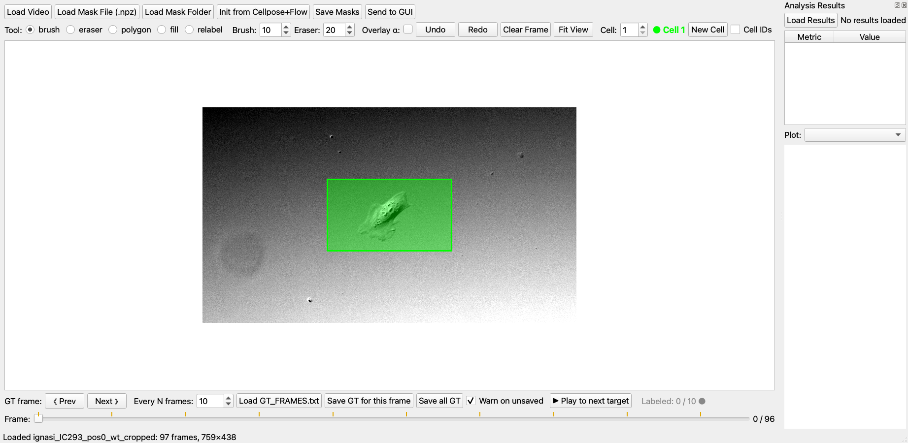
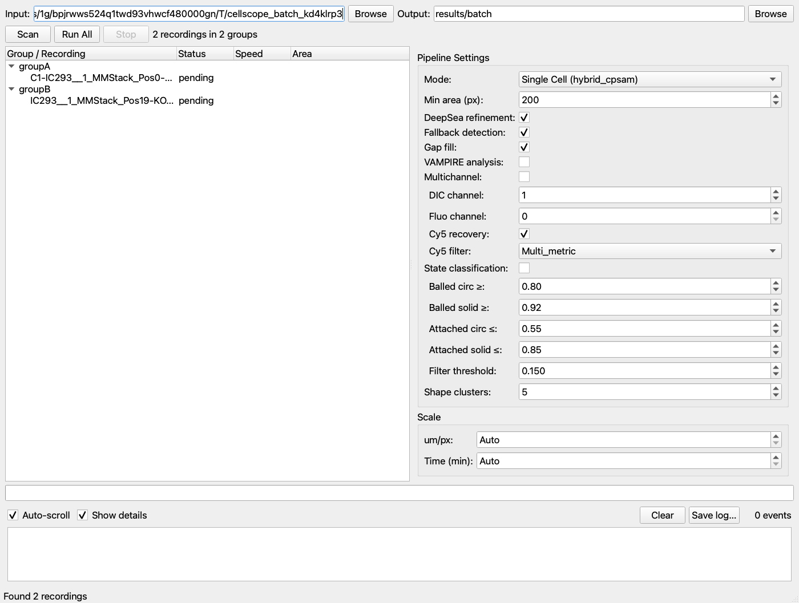
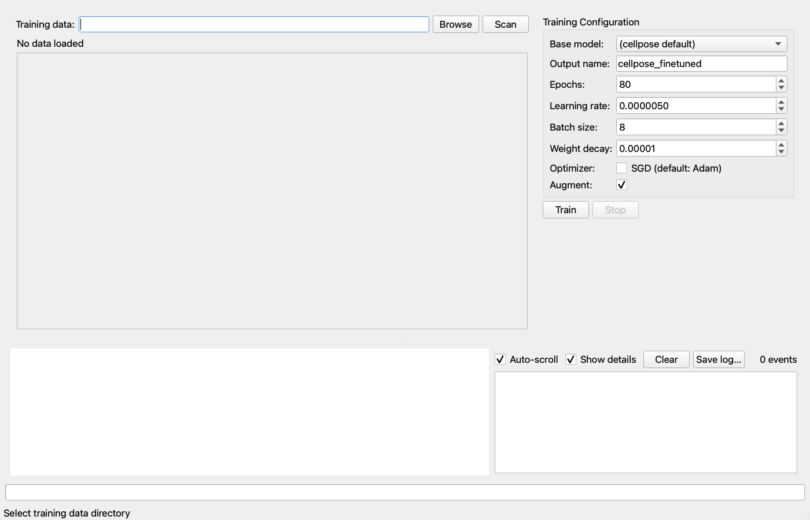

# CellScope — User Manual

## Getting Started

### Launching CellScope

```bash
conda activate cellpose
python main_suite.py
```

> **Always launch from the `cellpose` env.** The suite GUI lives there.
> The pipeline transparently delegates to the sibling `cellpose4` env
> whenever it needs cpsam (the ViT-based detector). You should never
> have to switch envs by hand.

This opens the suite launcher with buttons for each application.
Click any button to open that tool. You can run multiple tools
simultaneously.

### Preparing Your Data

Each recording needs:
1. A video file (`.tif`, `.tiff`, `.mp4`, `.avi`, or `.mov`)
2. A JSON sidecar with the same base name containing scale info:

```json
{
  "name": "My Recording",
  "um_per_px": 0.65,
  "time_interval_min": 5.0
}
```

If no JSON file exists, CellScope uses defaults (1.0 μm/px,
1.0 min/frame).

---

## Detection & Analysis (main_focused.py)

The primary workflow for analyzing a single recording.


*The Detection & Analysis GUI offscreen capture showing the standard layout.*

### Single-Cell Detection


*DIC single-cell detection (red contour) on a VAMPIRE keratinocyte recording.*

### Pipeline Stages

**1. Load** — Click Load or drag-and-drop a video file onto the
window. The recording opens in the image viewer. Scale values
(μm/px, time interval) auto-populate from the JSON sidecar.

**2. Detect** — Click Detect to run the hybrid cpsam pipeline.
Progress shows in the status bar. When complete, cell boundaries
appear as colored overlays on the image. The frame navigator bar
(below the image) shows green for detected frames, red for missed,
orange for fallback-rescued.

**3. Edit Masks** (optional) — Click Edit Masks to open the mask
editor. Draw/erase cell boundaries, then click "Send to GUI" to
push corrections back. The analysis will use your edited masks.

**4. Analyze** — Click Analyze to compute migration, morphology,
and edge dynamics. Results appear in the Summary tab (text) and
Graphs tab (14 plot types).

**5. Export** — Click Export to save masks, metrics, plots, and
overlay TIFFs. Choose output format (PNG/SVG/PDF) and DPI.

### Image Viewer Controls

- **Brightness/Contrast**: sliders, or click "Auto B/C" for
  percentile-based stretch
- **Zoom**: scroll wheel (centered on cursor), +/- buttons, or
  "Fit View" to reset
- **Pan**: right-click drag or Ctrl+left-click drag
- **Mask overlay**: toggle with "Mask" checkbox, adjust opacity
- **Contour lines**: toggle with "Contour" checkbox
- **Frame navigation**: slider or left/right arrow keys

### Pipeline Mode

- **Single Cell**: detects one cell per frame.
  - DIC modality → `hybrid_dic` (cpsam_dic + DeepSea, fallback to
    CP3 cellpose_dic).
  - Phase-contrast → `hybrid_cpsam` (default cpsam + DeepSea, fallback
    to cellpose+MedSAM+DeepSea).
- **Multi Cell**: detects and tracks multiple cells across frames.
  Automatically uses the corresponding `_multi` pipeline. Handles
  division events. **Always preferred when the recording has more
  than one cell** — gap fill helps recover frames where individual
  cells are momentarily missed.

### Modality (Auto / DIC / Phase-contrast)

Top of the params panel. The default **Auto** classifies each frame
by texture statistics — DIC has high local-variance backgrounds, while
phase-contrast is smoother. If auto-detection ever picks the wrong
modality (e.g. on unusual recordings), pin it by hand.

### DIC model selector

Below the modality picker. Lists all DIC fine-tunes found under
`data/models/`:

- **Auto (best available)** — picks `cpsam_dic` if present, else
  `cellpose_dic_v3`, else `_v2`, else `_v1`. Recommended.
- **cpsam_dic** — ViT-based DIC fine-tune. **Best on every benchmark
  we've measured** (0.795 IoU on our-GT, 0.697 on VAMPIRE OOD).
  Loads via the cellpose4 subprocess automatically.
- **cellpose_dic_v3 / v2 / cellpose_dic** — older CP3 fine-tunes,
  faster but lower IoU. Useful as fallbacks or for low-RAM machines.

### Parameters

- **Min area (px)**: minimum mask area to accept as a real cell
  (smaller = debris). Default 500. Drop to ~200 for small/mitotic
  cells, raise to 1000+ for large cells with lots of background
  noise.
- **Expected cells**: number of cells to keep per frame.
  "Auto" = no filtering. Set to N if you know exactly how many cells
  are in the recording — anything beyond the N largest is treated
  as debris.
- **DeepSea refinement**: toggle the DeepSea union step (default:
  on). Tightens cpsam's already-good boundaries on filopodia and
  drops spurious dots via fill_holes + largest_CC.
- **Fallback detection**: when cpsam returns nothing in a frame,
  fall back to cellpose+MedSAM+DeepSea via subprocess (default: on).
  Worth keeping on — cheap and only fires on empty frames.
- **TTA (augment)**: run cpsam on 4 rotations and merge (default:
  off). ~4× slower per frame but recovers cells cpsam misses at the
  default orientation. Worth turning on for recordings with cells
  in unusual orientations.
- **Gap fill**: re-detect with `cpsam(augment=True)` for tracked
  cells that disappear for a frame or two (default: on, multi-cell
  only). 100% gap fill on the recordings we've tested.
- **Tiling**: split each frame into N×N tiles, run cpsam per tile,
  union (default: off). Mainly for >1024² recordings where cells
  span a smaller fraction of the frame than cpsam expects. 3×3 with
  64 px overlap is a good starting point.

### ROI Selection

Restrict analysis to a region of interest:
1. Edit menu → Select ROI → choose shape (Rectangle, Ellipse,
   or Polygon)
2. Draw on the image (left-click vertices, right-click to close
   polygon)
3. Check "Apply ROI" in the parameters panel
4. The yellow dashed outline shows the active ROI on all frames

### Graph Types

**Single-cell (10 types):**
Trajectory, Speed vs Time, MSD, Direction Autocorrelation,
Area vs Time, Shape Panel (6 metrics), Edge Kymograph,
Edge Summary Bar, Boundary Confidence, Consecutive IoU

**VAMPIRE shape modes (4 additional):**
Shape Modes (PCA scatter), Mode Distribution (histogram),
Mode Over Time, Eigenshape Variations

**Multi-cell comparison (4 additional):**
Speed Comparison, Area Comparison, Trajectory Comparison,
Cell Summary Table

Select "All Cells" in the Cell dropdown to see overlaid traces
for all tracked cells.


*Trajectory plot colored by frame number, showing cell migration path. Green circle = start, red square = end.*

---

## Mask Editor (main_editor.py)


*Mask editor with results panel dock.*

### Tools

- **B** — Brush: paint cell pixels (left-click drag)
- **E** — Eraser: remove cell pixels
- **P** — Polygon: click vertices, right-click to close and fill
- **F** — Fill: flood-fill connected background region


### Multi-Cell Labels

Press **1-9** to select which cell ID to paint with. Each cell
gets a distinct color (green, red, blue, yellow, magenta, cyan,
orange, purple, lime).

### Keyboard Shortcuts

- **Left/Right arrows**: previous/next frame
- **Ctrl+Z**: undo
- **Ctrl+Shift+Z**: redo
- **Ctrl+S**: save masks

### Saving Masks

Click "Save Masks" to export as:
- PNG stack: `frame_NNNN_masks.png` (uint16, pixel value = cell ID)
- NPZ: `masks.npz` with key "masks"

Click "Send to GUI" to push edits back to the Detection & Analysis
window (if it launched the editor).

---

## Batch Processing (main_batch.py)


*Batch processing window with directory scanner and pipeline settings.*

### Directory Structure

Organize recordings by treatment group:
```
experiment/
  control/
    cell1.tif + cell1.json
    cell2.tif + cell2.json
  treated/
    cell3.tif + cell3.json
```

### Workflow

1. Set input directory → click **Scan** to discover recordings
2. Configure pipeline settings (mode, min area, refinement toggles)
3. Click **Run All** to process every recording
4. Results saved per-recording (masks.npz, metrics.json, plots)
5. Group summary CSVs generated automatically

---

## Tracking & Comparison (main_tracking.py)


*Tracking & Comparison main window with single-recording and batch-comparison tabs.*

### Single Recording Tab

Load a recording + masks (.npz), then:
1. Click **Track Cells** to run Hungarian tracking
2. Track table shows per-cell statistics
3. Click a track row to highlight that cell in the viewer
4. Click **Analyze** for per-cell metrics and plots

### Batch Comparison Tab

1. Set input directory → **Scan** to find recordings
2. Select detection mode → **Run All**
3. Select a metric from the dropdown (speed, area, persistence...)
4. View box/violin plot with significance brackets
5. Statistical results show p-values and effect sizes

---

## Model Training (main_training.py)


*Model training GUI with data preview and live loss curve.*

### Preparing Training Data

Create a folder with image+mask pairs:
```
my_training_data/
  frame_0001.png          ← grayscale DIC/phase image
  frame_0001_masks.png    ← uint16, pixel value = cell ID
  frame_0002.png
  frame_0002_masks.png
  ...
```

### Training Workflow

1. Select training data directory → click **Scan** to preview pairs
2. Configure: base model, output name, epochs, learning rate
3. Enable augmentation (recommended: adds noise, gamma, flip variants)
4. Click **Train** → watch live loss curve
5. Trained model saved to `data/models/<your_name>`

The new model appears automatically in detection mode dropdowns.

---

## Choosing settings for your recording

A short decision tree. For a deeper dive, see
**[docs/recording_recommendations.md](recording_recommendations.md)**.

| If… | Do this |
|---|---|
| **DIC** (textured background) | Modality = DIC, model = Auto (picks `cpsam_dic`). |
| **Phase-contrast** (smooth background) | Modality = Phase-contrast. Uses default cpsam + DeepSea. |
| **Multiple cells per frame** | Switch to Multi-Cell mode. Always. Gap fill catches momentary misses. |
| **Single cell, cropped recording** | Single-Cell mode is fine and faster. |
| **Cell counts vary, want to filter debris** | Set Expected cells to the typical count. |
| **Cells appear in odd orientations** | Enable TTA (augment). 4× slower but more robust. |
| **Frame ≥ 1024×1024 with small-ish cells** | Enable tiling, 3×3 with overlap=64. |
| **You see one cell tracked but a second cell visibly missing** | Enable TTA *and* use Multi-Cell mode (gap fill). |
| **You see debris being tracked as cells** | Raise Min area, or set Expected cells = N to keep only the N largest. |

---

## Troubleshooting

### "Not a CP4 model" error
You're trying to load a CP3 fine-tune in cellpose4 (or vice versa).
The pipeline handles this automatically via subprocess delegation —
you should never see this error from the GUI. If you do, both conda
envs probably aren't installed. Run `bash install.sh` (or `install.bat`
on Windows).

### Slow detection
Check Settings → System Info for GPU status. If no GPU detected:
- macOS: requires macOS 12.3+ and a recent PyTorch (auto-installed
  by `install.sh`).
- Linux/Windows: install CUDA PyTorch in *both* envs:
  ```bash
  conda run -n cellpose  pip install torch==2.7.0 torchvision==0.22.0 \
      --index-url https://download.pytorch.org/whl/cu121
  conda run -n cellpose4 pip install torch==2.7.0 torchvision==0.22.0 \
      --index-url https://download.pytorch.org/whl/cu121
  ```

### Empty detection on some frames
- Enable "Fallback detection" and (multi-cell only) "Gap fill".
- Enable TTA — recovers cells missed at default orientation.
- Lower "Min area" if you suspect cells smaller than 500 px.
- For DIC, confirm the modality is set to DIC (Auto sometimes
  classifies very-low-contrast DIC as phase-contrast).

### Debris being kept as cells
- Raise "Min area" (default 500; try 1000–2000 for noisy data).
- Set "Expected cells" to the actual cell count — extras are dropped.
- Make sure DeepSea refinement is on; it filters small spurious blobs
  via `fill_holes + largest_CC`.

### Mask editor won't load masks
Masks must be uint16 PNG (pixel = cell ID, 0 = background) or NPZ
with key `"masks"` and an `(N, H, W)` array. Boolean masks are
auto-converted.

---

## VAMPIRE Shape Mode Analysis

VAMPIRE (Lam et al., Nature Protocols 2021) quantifies morphological
heterogeneity by decomposing cell contours into principal shape modes.

### Enabling VAMPIRE

- **Detection & Analysis GUI**: check "VAMPIRE shape modes" in the
  Analysis parameters. Set the cluster count (default 4) to control
  how many discrete shape modes K-means produces.
- **Batch GUI**: check "VAMPIRE analysis" in Pipeline Settings.
  The `shape_entropy` metric is added to batch summary CSVs.
- **Tracking GUI**: select "Shape Entropy (VAMPIRE)" from the
  comparison metrics dropdown to compare heterogeneity across groups.

### How it works

1. **Contour extraction** -- the cell boundary is extracted from
   the binary mask for each frame
2. **Resampling** -- each contour is resampled to 50 equidistant
   points and registered (centroid-normalized, rotationally aligned)
3. **PCA** -- principal component analysis on all registered contours
   produces eigenshapes (the dominant axes of shape variation)
4. **K-means clustering** -- contours are clustered into discrete
   shape modes representing morphological phenotypes
5. **Shannon entropy** -- the entropy of the mode distribution
   measures heterogeneity (higher entropy = more variable shape
   over time)

### Interpreting results

- **Shape Modes scatter**: PCA projection of all contours, colored
  by cluster. Tight clusters indicate consistent morphology; spread
  indicates variability.
- **Mode Distribution**: histogram of how often each shape mode
  occurs. A uniform distribution (high entropy) means the cell
  frequently changes shape.
- **Mode Over Time**: which shape mode the cell occupies at each
  frame. Persistent blocks indicate stable morphology; rapid
  switching indicates dynamic shape changes.
- **Eigenshape Variations**: the mean contour +/- each principal
  component, showing what each shape axis captures (e.g., elongation,
  bending, branching).

### Requires

`pip install vampire-analysis` (already in `environment.yml`).
